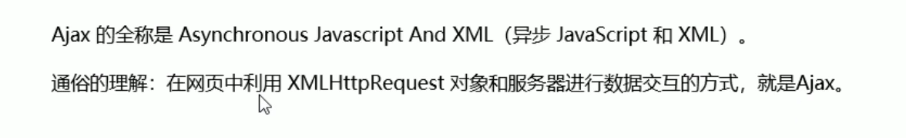
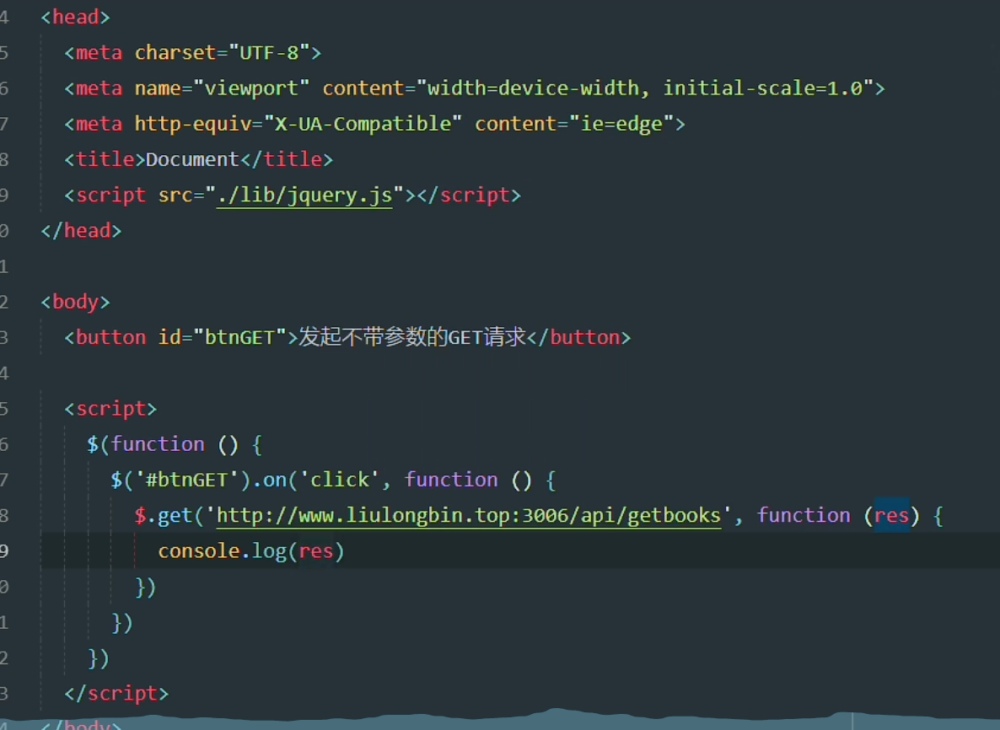
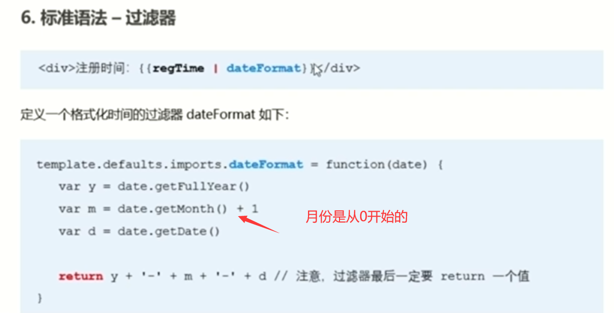
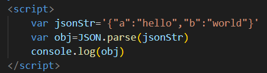
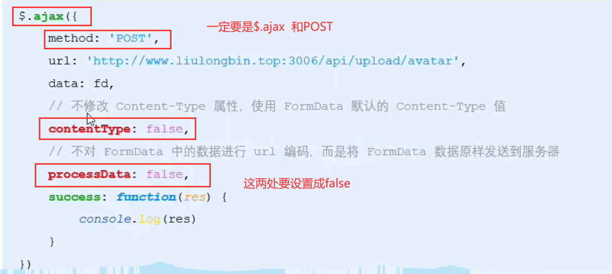
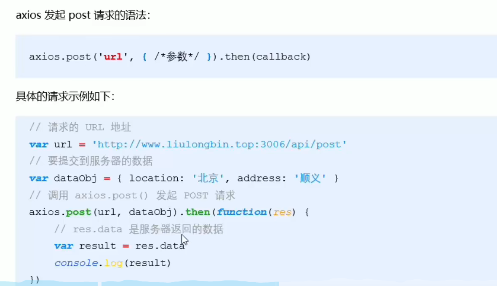
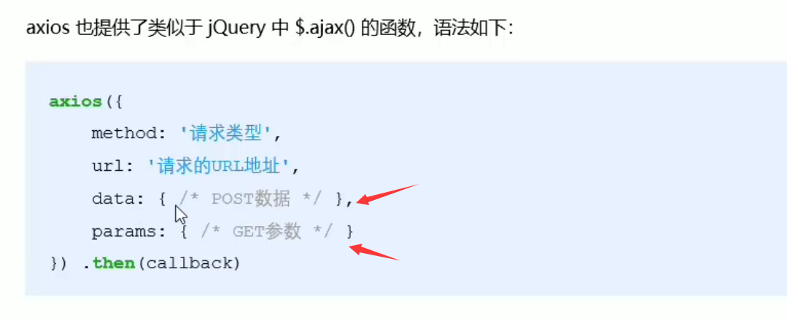
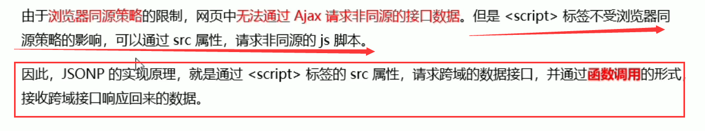
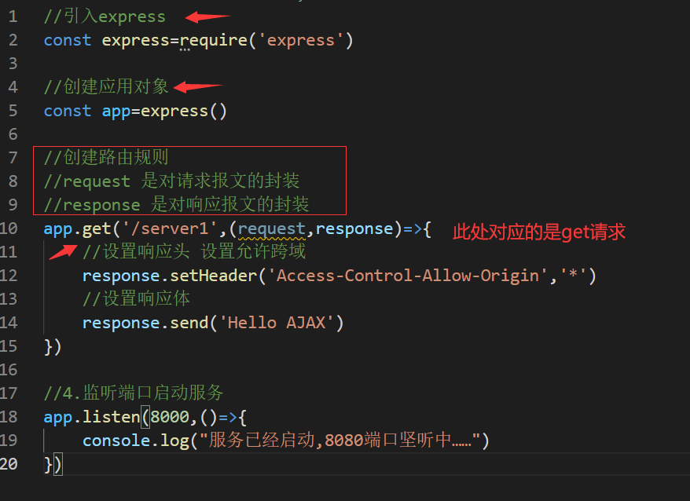
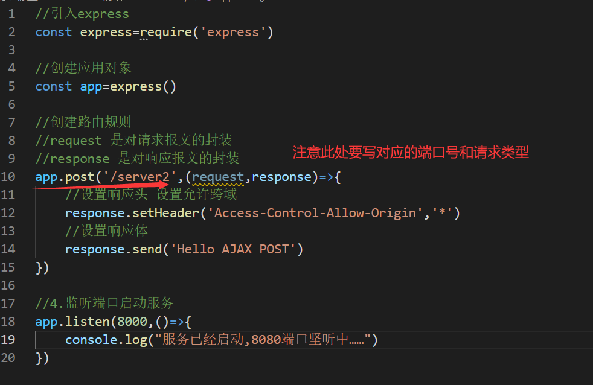

1.客户端与服务器的概念

客户端：上网过程中，负责获取和消费资源的电脑，叫作客户端

服务器：上网过程中，负责存放和对外提供资源的电脑，叫作服务器，本质上是一台电脑，但是它的性能要比电脑    高很多

## 2.URL地址

### 1.URL地址的概念

 

### 2.URL地址的组成部分

 

## 3.客户端与服务器的通信过程

 

 

## 4.服务器对外提供了哪些资源

### 1.数据资源

 

 

### 2.网页中如何请求数据

   

### 3.资源的请求方式

  

## 5.了解AJAX

### 1.什么是AJAX

 

### 2.为什么要学AJAX

 

### 3.AJAX的应用场景

**用户名检测**

 

**搜索提示**

 

**数据分页提示**

 

**数据的增删改查**

 

## 6.jQuery中的Ajax

### 1.了解jquery中的Ajax

 

### 2.   $.get()函数的语法

 

### 3.  $.get()发起不带参数的请求

 

 

### 4.  $.get()发起带参数的请求

 

 

### 5. $.post()函数的语法

 

### 6. $.post()向服务器提交数据

  

### 7. $.ajax()函数的语法

    

### 8. $.ajax发送GET请求

 

###  9. $.ajax发送POST请求

 

 

## 7.接口

### 1.接口的概念

 

### 2.接口的请求过程

#### 通过get方式请求接口

 

#### 通过post方式请求接口

 

### 3.接口测试工具 

什么是接口测试工具？

为了验证接口能否被正常访问，我们常常需要使用接口测试工具来对数据进行检测。

好处：接口测试工具能让我们在不写任何代码的情况下，对接口进行调用和测试      需要下载 PostMan 

 

#### 了解PostMan界面的组成部分

  

###   4.使用PostMan测试Get接口

  

注意：要在集成终端里面输入 node  server启动 .js 文件 

 

 

### 5.使用PostMan测试Post接口

 

  

###  6.什么是接口文档

#### 1.什么是接口文档

接口文档，顾名思义就是接口的说明文档（相当于说明书），他是我们调用接口的依据。好的接口文档包含了对接口URL，参数以及输出内容的说明，我们参照接口文档就能方便的知道接口的作用，以及接口如何进行调用

#### 2.接口文档的组成部分

 

##### 3.接口文档示例

 

 

## 8.案例——管理系统（未完）

#### 1.案例需要用到的库和插件

 

### 

## 9.案例——聊天机器人（未完）

 

  

## 10.form表单

### 1.form表单的基本使用

#### 1.什么是表单

 

#### 2.表单的组成部分

 

####  3.form标签的属性

 

##### 1.action

 

##### 2.target

  

  

##### 3.method

 

 

##### 4.enctype

 

 

####  3.表单的同步提交及缺点

##### 1.什么是表单的同步提交

通过点击submit按钮，触发表单提交的操作，从而使页面跳转到  action  URL  的行为，叫做表单的同步提交

##### 2.表单同步提交的缺点

 

##### 3.如何解决表单同步提交的缺点

 

### 2.通过Ajax提交表单数据

#### 1.监听表单提交事件

 

  

#### 2.阻止表单默认的提交行为

 

 

#### 3.快速获取表单中的数据

##### serialize()函数

 

 

  

有专门评论练习可以看一下在笔记里面  

## 11.模板引擎的基本概念

### 1.渲染UI结构时遇到的问题

  

### 2.什么是模板引擎

 

###  3.模板引擎的好处

 （1）减少了字符串的拼接操作

 （2）使代码结构更加清晰

 （3）使代码更易于阅读与维护

## 12.art-template模板引擎

### 1.简介

 

### 2.安装 

### 3.传统方式渲染UI结构

 

 

### 4.基本使用

（1）导入art-template

（2）定义数据

（3）定义模板

（4）调用template函数

 

###  5.标准语法

 art-template提供了{ { } }这种语法格式，在{ { } }内可以进行变量输出，或循环数组等操作，这种{ { } }语法在art-template中被称为标准语法。在{ { } }语法中，可以进行变量的输出，对象属性的输出、三元表达式的输出、逻辑或输出、加减乘除等表达式输出。

#### 1.输出

 

#### 2.原文输出

 

 

#### 3.条件输出

 

 

#### 4.循环输出

 

 

#### 5.过滤器

  

  

####  6.案例----新闻列表

实现步骤：（1）获取新闻数据（2）定义template模板（3）编译模板（4）定义时间过滤器（5）定义补零函数

 

 

 

 

 

## 13.模板引擎的实现原理

### 1.正则与字符串操作

#### 1. exec()——匹配字符串

 

 

   

 

#### 2.分组——（ ）

  

   

 

#### 3.replace( )——替换

 

 

##  14.XMLHttpRequest的基本使用

### 1.概念

 

###  2. 使用xhr发起GET请求

 

 

### 3.xhr对象的readyState属性

  

### 4.使用xhr发起带参数的GET请求

  

 

### 5.查询字符串

#### 1.什么是查询字符串

 

#### 2.GET请求携带参数的本质

 

 

 

### 6.URL编码与解码

#### 1.什么是URL编码

 

#### 2.URL编码与解码

 

  

#### 3.URL编码的注意事项

由于浏览器会自动对URL地址进行编码操作，因此，大多数情况下，程序员不需要关心URL地址的编码与解码操作。

 

### 7.使用xhr发起POST请求

 

 

## 15.数据交换格式

### 1.什么是数据交换格式

数据交换格式，就是服务器端与客户端之间进行数据传输与交换的格式

前端领域，经常提及的两种数据交换格式分别是XML和JSON。其中XML用的非常少，所以，我们重点要学习的数据交换格式就是JSON。

 

### 2.XML

#### 1.什么是XML

 

#### 2.XML和HTML的区别

 

#### 3.XML的缺点

 

### 3.JSON

#### 1.什么是JSON

 

#### 2.JSON的两种结构

 

 

  

 

#### 3.JSON语法注意事项

 

#### 4.JSON和JS对象的关系 

 

#### 5.JSON和JS对象的互转

 

  

  

#### 6.序列化和反序列化

把数据对象转换为字符串的过程，叫做序列化，例如：调用JSON.stringfy()函数的操作，叫做JSON序列化。

把字符串转换为数据对象的过程，叫做反序列化，例如：调用JSON.parse()函数的操作，叫做JSON反序列化。

## 16.封装自己的AJAX函数

### 1.要实现的效果

   

### 2.定义options参数选项

 

### 3.处理data参数

 先接收用户传过来的data对象，定义arr空数组，循环对象上面的每一个属性，每循环一个属性，就拼接成一个键值对的字符串，然后将这个字符串push到arr这个数组上,当整个for循环走完，就证明所有键值对都拼接好了，最后，通过数组的join方法，把每个键值对中间都用&符号连接起来然后return出去、

 

 

 

### 4.定义itheima函数

定义itheima函数,接收外界传过来的option配置选项，我们把外界传过来的data参数对象传给了resolveData函数

 

#### 5.判断请求的类型

 

 

## 17. XMLHttpRequest  Level2新特性

### 1.认识XMLHttpRequest  Level2

#### 1.旧版XMLHttpRequest的缺点

 （1）只支持文本数据的传输，无法用来读取和上传文件

  （2）传递和接收数据时，没有进度信息，只能提示有没有完成

#### 2.XMLHttpRequest   Level2的新功能

（1）可以设置HTTP请求的时限

（2）可以使用FormData对象管理表单数据

（3）可以上传文件

（4）可以获得数据传输的进度信息

### 2.设置HTTP请求时限

 

 

### 3.FormData对象管理表单数据

 

 

### 4.上传文件

 

#### 1.定义UI结构

 

#### 2.验证是否选择了文件

 

#### 3.向FormData中追加文件

 

#### 4.使用xhr发起上传文件的请求

 

 

#### 5.显示文件上传的进度 

 

##### 监听上传进度的事件

 

#### 监听上传完成的事件

 

 

### 5.JQuery实现文件上传

#### 1.定义UI结构

 

#### 2.验证是否选择了文件

 

#### 3.向FormData中追加文件

 

#### 4.使用JQuery发起上传文件的请求

 

### 6.JQuery实现loading效果

#### 1.ajaxStart（callback）    监听ajax发起请求

 

#### 2.ajaxStop（callback） 监听ajax结束请求

 

 

## 18.axios

### 1.什么是axios

Axios是专注于网络数据请求的库，相比于原生的XMLHttpRequest对象，axios简单易用，相比于jquery，axios更加轻量化，只专注于网络数据请求。

script标签引入 

### 2.axios发起GET请求

  

 

### 3.axios发起POST请求

 

 

### 4.直接使用axios发起请求

#### 1.发起GET请求

 

 

#### 2.发起POST请求

 

 

## 19.跨域和JSONP

### 1.同源策略

#### 1.什么是同源

如果两个页面的协议，域名和端口号都相同，则两个页面具有相同的源

 

 

#### 2.什么是同源策略

 

### 2. 跨域

#### 1.什么是跨域

 

#### 2.浏览器对跨域请求的拦截

 

#### 3.如何实现跨域数据请求

 

### 3.JSONP

#### 1.什么是JSONP

 

#### 2.	JSONP的实现原理

 

#### 3.自己实现一个简单的JSONP

（1）定义一个function回调函数

（2）通过script标签的src属性来请求一个接口，这个接口我们希望返回一个函数的调用，通过查询字符串的形式告诉服务器调用哪个函数  即callback=函数名

（3）服务器根据它传过去的函数名字返回一个函数调用

 

 

#### 4.JSONP的缺点

 

 

 

 

#### 5.jquery中的JSONP 

 

 

 

#### 6.自定义参数及回调函数名称

 

#### 7.jquery中JSONP的实现过程

 

 

 

## 20.淘宝搜索案例

### 1.获取用户输入的搜索关键词

  

## 21.防抖和节流

### 1.防抖

好处：事件被频繁触发的时候，可以保证事件只被触发一次，不会被频繁的执行

 

应用场景：用户在输入框中连续输入一串字符时，可以通过防抖策略，只在输入完成后，才执行查询的请求，这样可以有效减少请求的次数，节约请求资源。

### 2.节流

 

应用场景

（1）鼠标连续不断地触发某事件（如点击），只在单位时间内触发一次

（2）懒加载时要监听计算滚动条的位置，但不必每次滑动都触发，可以降低计算的频率，而不必去浪费CPU资源

#### 1.节流阀

 

不使用节流阀实现鼠标跟随效果

 

使用节流阀实现鼠标跟随效果	

 

### 3.防抖和节流的区别

 

## 	22.HTTP协议

### 1.什么是通信

通信就是信息的传递和交互

通信三要素：主体、内容、方式

#### 1.现实生活中的通信

 

#### 2.互联网中的通信

 

### 2.什么是通信协议

 

#### 1.	现实生活中的通信协议

 

#### 2.互联网中的通信协议

 

### 3.HTTP协议

#### 1.什么是HTTP协议

 

#### 2.HTTP协议的交互模型

### 4.HTTP请求消息

#### 1.HTTP请求消息的组成部分

##### 1.请求行

 

##### 2.请求头

 

常见的请求头字段

 

 

##### 3.空行

 

##### 4.请求体

 

### 5.HTTP响应消息

响应消息就是服务器响应给客户端的消息内容，也叫作响应报文

#### 1.HTTP响应消息的组成部分

 

##### 1.状态行

 

##### 2.响应头

 

 

##### 3.空行

 

##### 4.响应体

### 6.HTTP请求方法

 

 

### 7.HTTP响应状态码

#### 1.什么是响应状态码

 

#### 2.组成及分类

 

##### 1.   2**成功相关的响应状态码

##### 2.   3**重定向相关的响应状态码

 

##### 3.   4**客户端错误相关的响应状态码

##### 4.   5**服务端错误相关的响应状态码

 

##  AJAX请求的基本操作

### Get请求

**1-1Get.HTML**

  

**server.js**

 

### Post请求

**1-2POST.html**

 

**server2.js**

 

## 设置响应头

**1-2POST.html**

 

**server2.js**

 

## AJAX服务端响应JSON数据

**手动对数据进行转化**

 

 

 

## IE缓存问题解决

**ie.html**

 

**server.js**

 

## 请求超时与网络异常

**1.html**

 

**server.js**

 

## 取消请求

**1.html**

 

**server.js**

 

## 请求重复发送问题

**1.html**

 

**server.js**

 

## jQuery发送AJAX请求

**第一个参数：给谁发**

**第二个参数：发送什么参数，这个参数类型为对象**

**第三个参数：回调，回调当中接收一个参数，这个参数是响应体，在函数内部可以对这个响应体进行操作**

**第四个参数：响应体类型**

 

 

## Axios发送AJAX请求

## 使用fetch函数发送AJAX请求

 

 

## 同源策略

 

 

​    