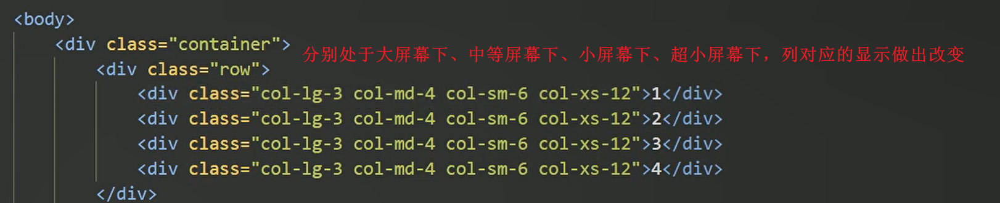

## 响应式开发

### 1.原理

  

### 2. 响应式布局容器

   

         

### 3.响应式导航栏案例

 

  

## 2.Bootstrap前端开发框架

### 1.简介 

  

### 2.优点

 

###  3.按钮

  

### 4.布局容器

  

 

## 3.Bootstrap栅格系统

### 1.介绍

  

### 2.选项参数

 

 

 

 

  

### 3.列嵌套

 

  

### 4.列偏移

  

 

### 5.列排序

 

 

### 6.响应式工具

  

 

## 4.阿里百秀需求分析

 

 

  

 

 

  

  

bootstrap内部设定好的，只要给a添加样式，它就会给a这个标签生成before的伪元素，然后在伪元素里面帮我们把字体图标给设置好了

