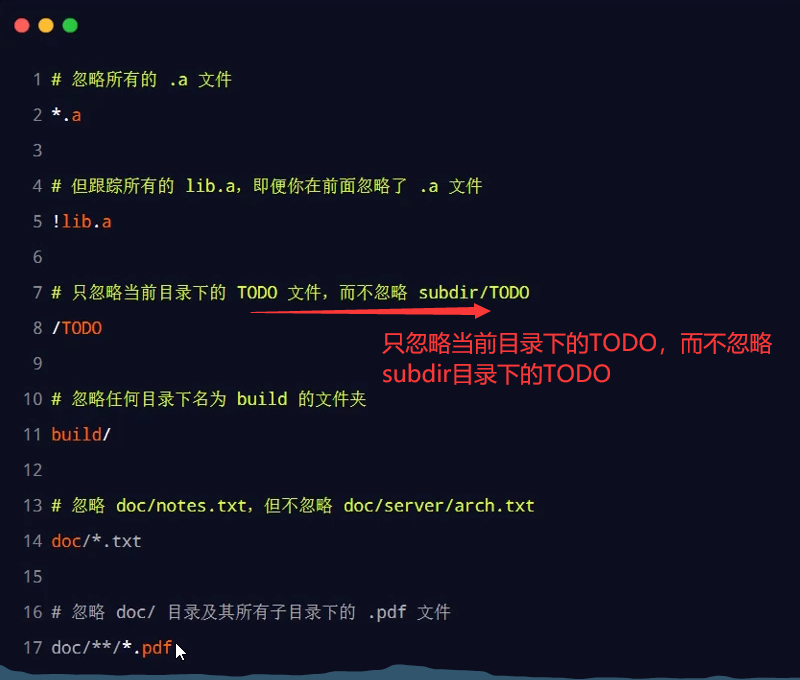
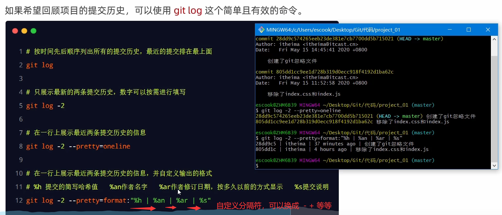
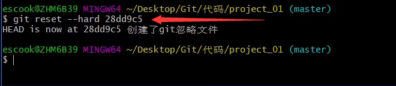
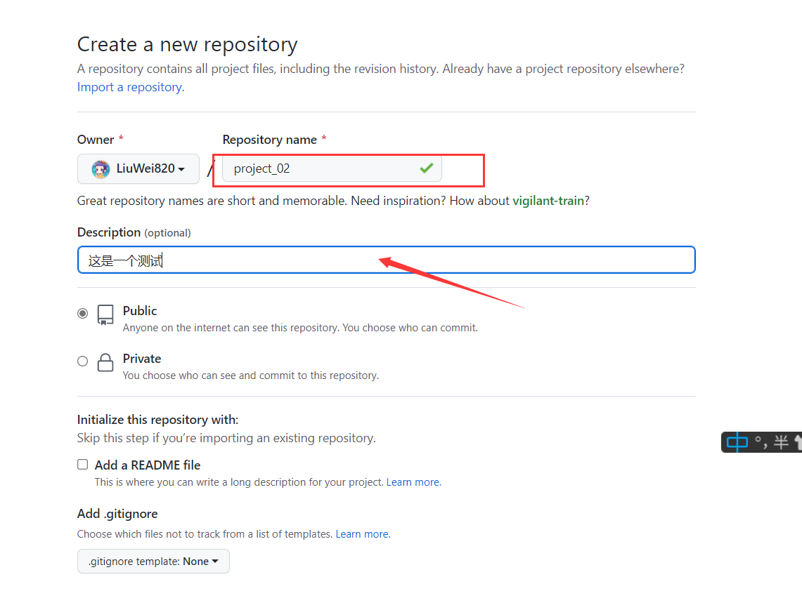
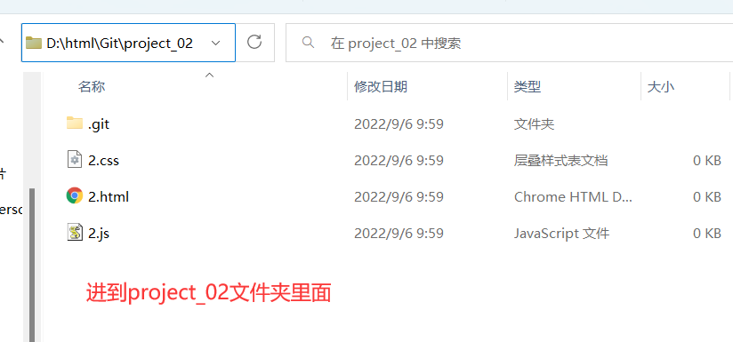
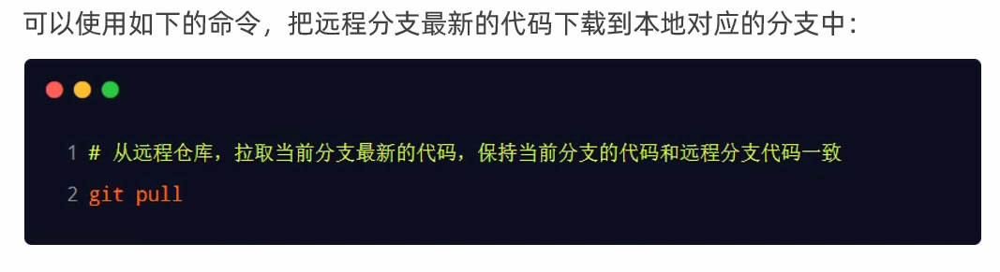

# Git

## 1.起步---关于版本控制

### 1.文件的版本

 

### 2.版本控制软件

 

### 3.使用版本控制软件的好处

 

### 4.版本控制系统的分类

 

#### 1.本地版本控制系统

 

#### 2.集中化的版本控制系统

 

#### 3.分布式的版本控制系统

 

## 2.起步---Git基础概念 

### 1.什么是Git

 

### 2.Git特性

 

#### 1.SVN的差异比较

 

#### 2.Git的记录快照

 

#### 3.近乎所有操作都是本地执行

### 3.Git中的三个区域

### 4.Git中的三种状态

 

### 5.基本的Git工作流程

 

## 3.安装并配置Git

### 1.	在Windows中下载并安装

 

### 2.配置用户信息

 

  

### 3.Git的全局配置文件

 

C盘-->用户-->.gitconfig

### 4.检查配置信息

 

### 5.获取帮助信息

 

## 3.Git基础---Git的基本操作

### 1.获取Git仓库的两种方式

### 2.在现有的目录中初始化仓库

 

### 3.工作区中文件的4种状态

 

Git操作的终极结果是：让工作区中的每个文件都处于  “未修改”  的状态，因为未修改的状态就表示说工作区里边文件的内容和仓库里边所保存的文件内容完全一致。

### 4.检查文件的状态

 

### 5.以精简的方式显示文件状态

 

### 6.跟踪新文件

 

### 7.提交更新

 

 

### 8.对已提交的文件进行修改

 

###  9.暂存已修改的文件

 

### 10.提交已暂存的文件

 

### 11.撤销对文件的修改

 

### 12.向暂存区中一次性添加多个文件

  

### 13.取消暂存的文件

 

### 14.跳过使用暂存区

 

 

### 15.从Git仓库中移除文件

 

 

 

### 16.忽略文件

 

### 17.glob模式

 

### 18.    .gitignore文件的例子

 

 

   

### 19.查看提交历史

 

### 20.回退到指定的版本

 

 

### 21.小结

 

# Github

## Github---了解开源相关的概念

### 1.什么是开源

 

### 2.什么是开源许可协议

 

### 3.常见的5种开源许可协议

 

### 4.为什么要拥抱开源

 

### 5.开源项目托管平台

 

## Github---远程仓库的使用

### 1.新建空白远程仓库

 

 

### 2.新建空白远程仓库成功

 

### 3.远程仓库的两种访问形式

 

### 4.基于HTTPS将本地仓库上传到Github

 

 

注意：第一次推送时要使用push -u命令，之后第二次、第三次就直接使用push命令就行了。

### 5.  SSH  Key

 

### 6.生成SSH  Key

 

 

 

### 7.配置 SSH  Key

 

 

 

 

 

 

 

 

### 8.检测Github的SSH Key是否配置成功

 

 

### 9.基于SSH将本地仓库上传到Github

 

 

 

 

 

### 10.将远程仓库克隆到本地

 

 

 

 

 

 

 

## Git分支---本地分支操作

### 1.分支的概念

 

### 2.分支在实际开发中的作用

 

### 3.master主分支

 

### 4.功能分支

 

### 5.查看分支列表

 

 

 

### 6.创建新分支

 

 

### 7.切换分支

  

### 8.分支的快速创建和切换

 

 

### 9.合并分支

 

 

### 

### 10.删除分支

注意：删除哪个分支时不能在该分支上。

 

 

 

### 11.遇到冲突时的分支合并

 

#### 1.先在reg分支上对2.html内容进行编辑

 

 

  

#### 2.再切换到main分支上对2.html内容进行编辑

 

 

#### 3.分支合并

 

采用当前更改就会保留main分支上的修改

采用传入的更改就会保留reg分支上的修改

采用保留双放更改会保留main、reg分支上都做的修改

 

 

 

## Git分支---远程分支操作

### 1.将本地分支推送到远程仓库

 什么是origin：你的代码库(repository)可以存放在你的电脑里，同时你也可以把代码库托管到Github的服务器上。在默认情况下，`origin`指向的就是你本地的代码库托管在Github上的版本。 

  

 

 

 

 

### 2.查看远程仓库中所有分支的列表

 

 

### 3.跟踪分支

 

#### 1.先删除本地的reg分支

 

#### 2.再将远程的register分支下载到本地

 

第二种方法，自己设置本地分支名

 

### 4.拉取远程分支的最新代码

 

 

 

 

 

 

### 5.删除远程分支

 

 

 

