函数

### <!--函数作用域-->

函数可以访问全局，但是全局不可以访问函数

 

  

  

  

  

## this

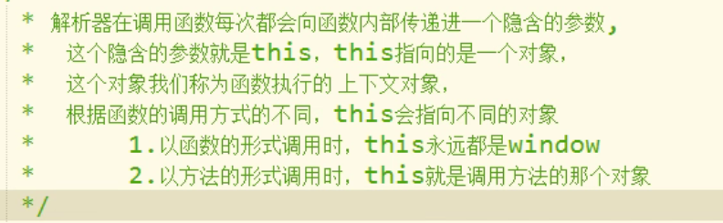 

 

### 使用工厂方法创建函数对象

 

 

## 构造函数

   

 

 

 

 

 

### 构造函数的修改

 

 

## 原型对象

原型 prototype：我们所创建的每一个函数，解析器都会向函数中添加一个属性protype

这个属性对应着一个对象，这个对象就是我们所说的原型对象

如果函数作为普通函数调用prototype，则没有任何作用

当函数作为构造函数调用时，他所创建的对象中都会有一个隐含的属性指向该构造函数的原型对象

我们可以通过    下划线 proto下划线 (两个下划线)   来访问该属性 

原型对象相当于一个公共的区域，所有同一个类的实例都可以访问到这个原型对象，我们可以将对象中共有的内容统一设置到原型对象中。

原型对象也是对象，所以他也有原型，当我们访问对象的一个属性或方法时，他会先在自身中寻找，如果有则直接使用，如果没有则去原型对象中寻找，如果找到则直接使用。

如果没有则去原型对象中寻找，直到找到Object对象的原型，Object对象的原型没有原型，如果在Object中依然没有找到，则返回Underfined。

我们创建构造函数时，可以将这些对象共有的属性和方法统一添加到构造函数的原型对象中，这样不用分别对每一个对象添加，也不会影响全局作用域，就可以使每一个对象都具有这些属性和方法。

 

 

## toString（）	

 

## 垃圾回收（GC）

程序运行过程中也会产生垃圾，垃圾积攒过多会导致程序运行的速度过慢，所以我们需要一个垃圾回收机制来处理程序运行过程中产生的垃圾；当一个对象没有任何的变量或属性对它进行引用，此时我们将永远无法操作该对象，此时这种对象就是一个垃圾，这种对象过多会占用大量的内存空间，导致程序运行变慢，所以这种垃圾必须清理。

在JS中拥有自动的垃圾回收机制，会自动将这些垃圾对象从内存中销毁，我们不需要也不能进行垃圾回收的操作。

我们需要做的只是将不再使用的对象设置null即可

## 数组（Array）

### 基本属性

数组也是一个对象，它和普通的对象功能类似，也是用来存储一些值的。

不同点：普通对象是使用字符串作为属性名的，而数组是使用数字来作为索引操作元素

索引：从0开始的整数就是索引

对象是属性名和属性值，而数组是索引和值

数组的存储性能比普通对象要好，在开发中我们经常使用数组来存储一些数据

 

 

### 字面量

 

 

### 四个方法

#### push()

该方法可以向数组的末尾添加一个或多个元素，并返回数组的新的长度，可以将要添加的元素作为方法的参数传递，这样这些元素会自动的添加到元素的末尾，该方法会将数组新的长度作为返回值返回。

 

#### pop()

该方法可以删除数组的最后一个元素，并将被删除的元素作为返回值返回

  

#### unshift()

向数组开头添加一个或多个元素，并返回新的数组长度

向前边插入元素以后，其他的元素索引会依次调整

 

#### shift()

可以删除数组的第一个元素，并将被删除的元素作为返回值返回

 

### 遍历

#### for循环遍历

所谓遍历数组，就是将数组中所有的元素都取出来

 

#### 练习

 

 

 

#### forEach（）方法遍历

一般我们都是使用for循环去遍历数组，JS还为我们提供了一个方法用来遍历数组——forEach()

这个方法只支持IE8以上的浏览器，IE8以下的浏览器均不支持该方法，所以如果需要兼容IE8，则不要使用forEach（），还是使用for循环来遍历

 

  

### slice（）

  

### splice()

 

### 数组去重练习

 

### 数组的剩余方法

#### concat()

该方法可以连接两个或多个数组，并将新的数组返回，不会对原数组产生影响

 

该方法也可以用来连接两个或多个字符串（作用和+一样)

 

#### join()

该方法可以将数组转换为字符串，不会对原数组产生影响，而是将转换后的字符串作为结果返回

在join（）中可以指定一个字符串作为参数，这个字符串将会成为数组中元素的连接符

 

#### reverse()

该方法用来反转数组（前边的去后边，后边的去前边），会直接修改原数组

 

#### sort()

该方法可以用来对数据中的元素进行排序，会影响原数组，默认会按照Unicode编码进行排序

 

即使对于纯数字的数组，使用sort（）排序时，也会按照Unicode编码来排序，所以对数字进行排序时，可能会得到错误的结果。

 

我们可以自己来指定排序的规则。我们可以在sort（）添加一个回调函数，来指定排序规则，回调函数中需要定义两个形参，浏览器将会分别使用数组中的元素作为实参去调用回调函数。

使用哪个元素调用不确定，但是肯定的是在数组中a一定在b前边

浏览器会根据回调函数的返回值来决定元素的顺序

（1）当返回值大于0时，元素不交换位置

（2）当返回值小于0时，元素交换位置

（3）当返回值等于0时，元素不交换位置

   

  1）当 a - b < 0 时， 则 a 元素排在 b 元素的前面。

 

  2） 当 a - b = 0 时， a , b 元素的位置不变。

  	

  3） 当 a - b > 0 是， 则 b 元素排在 a 元素的前面。

 

##### 升序（a-b)

 

##### 降序(b-a)

 

#### call()和apply()

这两个方法都是函数对象的方法，需要通过函数对象来调用

当对函数调用call()和apply()都会调用函数执行

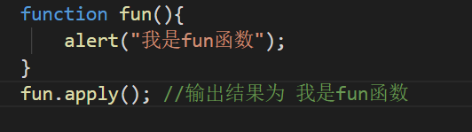 

  

在调用call()和apply()可以将一个对象指定为第一个参数，此时这个对象将会成为函数执行时的this

 

call()方法可以将实参在对象之后传递

 

apply()方法需要将实参封装到一个数组中统一传递

 

#### this的情况

1.以函数形式调用时，this永远都是window

2.以方法的形式调用时，this是调用方法的对象

3.以构造函数的形式调用时，this是新创建的那个对象

4.使用call()和apply()调用时,this是指定的那个对象

### arguments

在调用函数时，浏览器每次都会传递进两个隐含的参数：

1.函数的上下文对象this

2.封装实参的对象arguments

​    arguments是一个类数组对象，它可以通过索引来操作数据，也可以获取长度

​    在调用函数时，我们所传递的实参都会在arguments中保存

​    arguments.length可以用来获取实参的长度

 

我们即使不定义形参，也可以通过arguments来使用实参，只不过比较麻烦

arguments[0]表示第一个实参

arguments[1]表示第二个实参

 

 

它里边有一个属性叫做callee，这个属性对应一个函数对象，就是当前正在指向的函数的对象

 

 

 

### Data对象

 

 

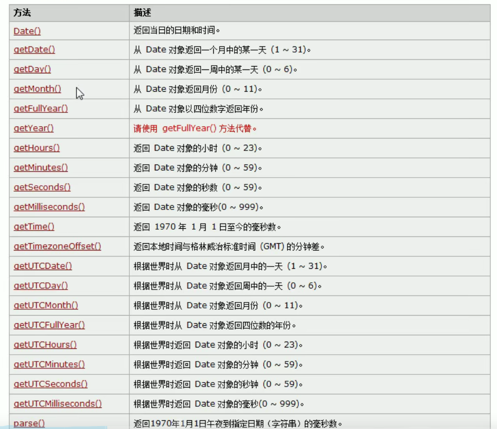 

 

 

### Math

Math和其它的对象不同，他不是一个构造函数，它属于一个工具类，不用创建对象，它里边封装了数学运算相关的属性和方法；比如：Math.PI

 

#### abs()  可以用来计算一个数的绝对值

 

#### ceil()  可以对一个数进行向上取整，小数位只要有值就自动进1

 

 

 

#### 生成0~10之间的随机数

 

 

#### 最大值与最小值

 

#### pow（x,y） 返回x的y次幂

 

#### sqrt ()   用于对一个数进行开方运算

 

### 包装类

#### 基本数据类型

String    Number    Boolean    Null   Undefined

#### 引用数据类型

Object

在JS中为我们提供了三个包装类，通过这三个包装类可以将基本数据类型转换为对象

String()   可以将基本数据类型字符串转换为String对象

Number()   可以将基本数据类型的数字转换为Number对象

Boolean()  可以将基本数据类型的布尔值转换为Boolean对象

 

 

 

### 字符串的方法

#### charAt()

可以返回字符串中指定位置的字符

根据索引获取指定的字符

 

#### charCodeAt（）

获取指定位置字符的编码（Unicode编码）

 

#### fromCharCode()

可以根据字符编码去获取字符

前提是通过String对象调用，即String.fromCharCode()

 

 

    																																																	

#### indexof()

该方法可以检索一个字符串中是否含有指定内容  (从前往后找)

如果字符串中含有该内容，则会返回其第一次出现的索引；如果没有找到指定的内容，则返回-1

可以指定一个第二个参数，指定开始查找的位置

 

 

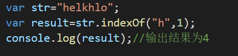 

#### lastIndexOf()

该方法可以检索一个字符串中是否含有指定内容  (从后往前找)，不会影响元素原先的索引

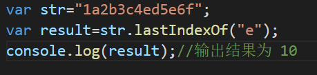 

#### slice()

可以从字符串中截取指定的内容，不会影响原字符串，而是将截取的内容返回	

参数：  第一个，开始位置的索引（包括开始位置）

​              第二个，结束位置的索引（不包括结束位置），如果省略第二个参数，则会截取后边所有的

 也可以传递一个负数作为参数，负数的话将会从后边计算

 

 

#### substring（）

可以用来截取一个字符串，作用与slice（）类似

参数：   第一个，开始位置的索引（包括开始位置）

​              第二个，结束位置的索引（不包括结束位置）

不同的是这个方法不能接受负值作为函数参数，如果传递了一个负值，则默认使用0

该方法还会自动调整参数位置，如果第二个参数小于第一个参数，则自动交换

 

#### substr()

用来截取字符串

参数：   第一个，截取开始位置的索引

​              第二个，截取的长度

 

#### split()

可以将一个字符串拆分成一个数组

参数：  需要一个字符串作为参数，将会根据字符串去拆分数组

如果传递一个空串作为参数，将会根据该字符串去拆分数组;即使不指定全局匹配（g），也会全都查找

  

 

 

 

 

#### toLocaleLowerCase()  转换为小写

将字符串转换为小写

 

#### toLocaleUpperCase()  转换为大写

将字符串转换为大写

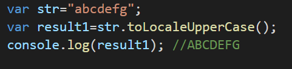 

### 正则表达式

 

#### 通过变量创建正则表达式

 

  

 

#### 通过字面量创建正则表达式

 

  

#### 或（|）

 

  

 ·

 

 

#### 拆分字母

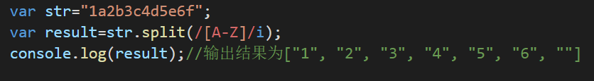 

#### search()

  

#### match()

  

#### replace()

 

#### 量词

 

 

 

  

 

 

 

 

 

 

#### 利用正则表达式判断电话号码格式是否正确

 

 	

 

 

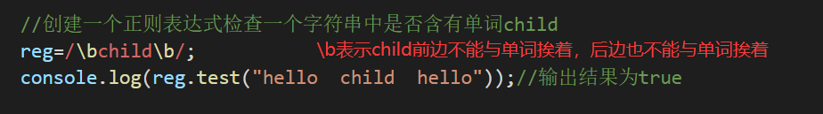 

##### 去除空格

 

##### 电子邮箱问题

 

 

### DOM

全称Document  Object  Model   文档对象模型

 

 

#### 修改按钮中的文字

 

#### 事件

 

  

 

 

 

#### 获取元素节点

 

####  获取元素子节点

 

#### 父节点和兄弟节点

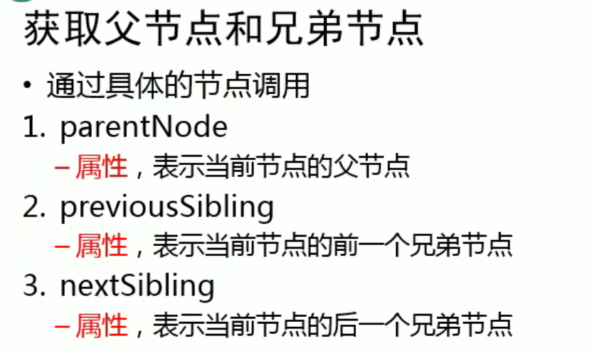 

#### 各种标签查询

  

 

#### DOM对象方法

 

#### Window对象方法

 

#### 获取元素的样式

 

 

 

#### currentStyle和getComputedStyle()

 

 

#### 属性和方法

 

#### addEventListener()、attachEvent()

 

  

### BOM

浏览器对象模型

BOM可以使我们通过JS来操作浏览器，在BOM中为我们提供了一组对象，用来完成对浏览器的操作

BOM对象：

- Window：代表的是整个浏览器的窗口，同时window也是网页中的全局对象

- Navigator：代表的是当前浏览器的信息，通过该对象可以来识别不同的浏览器

- Location：代表当前浏览器的地址栏信息，通过Location可以获取地址栏信息，或者操作浏览器跳转页面

- History：代表浏览器的历史记录，可以通过该对象来操作浏览器的历史记录，由于隐私原因，该对象不能获    取到具体的历史记录，而且该操作只在当次访问有效

- Screen：  代表用户的屏幕信息，通过该对象可以获取到用户的显示器的信息

  这些BOM对象在浏览器中都是作为window对象的属性保存的，可以通过window对象来使用，也可以直接使用(相当于全局对象)        

              

  ​          
  
  ### JSON
  
   

## JS高级

### 1.数据类型：

（1）基本(值)类型：String(任意的字符串)、Number(任意的数字)

​                                Boolean：true/false    underfined: underfined:    null:null

（2）对象(引用)类型：Object(任意对象)、Function(一种特别的对象，可以执行)

​                                    Array(一种特别的对象：数值下标，内部数据是有序的)

### 2.判断

typeof 返回数据类型的字符串表达 （可以判断：undefined/数值/字符串/布尔值）

​                                                            （不能判断：null和Object   Object和array）

instanceof 判断对象的具体类型 

===  可以判断undefined、null

### 3.实例对象与类型对象

 

### 4.基础问题

#### 1.undefined与null的区别 ？

undefined代表定义未赋值，null定义并赋值了，只是值为null

#### 2.什么时候给变量赋值为null ？

初始赋值，表明将要赋值为对象

结束前，让对象成为垃圾对象（被垃圾回收器回收） 

 

#### 3.严格区分变量类型和数据类型 ?

数据的类型：基本(值)类型、对象(引用)类型

变量的类型（变量内存值的类型）：

​          基本类型：保存就是基本类型的数据   

​          引用类型：保存的是地址值

#### 5.延申问腿

（1）什么是数据？

存储在内存中代表特定信息的xxx，本质上是0101

数据的特点：可传递、可运算

一切皆数据    内存中所有操作的目标：数据（算数运算、逻辑运算、赋值、运行函数

（2）什么是内存？

-内存条通电后产生的可存储数据的空间（临时的）

-内存产生和死亡：内存条（电路板）==>通电==>产生内存空间==>存储数据==>处理数据==>断电==>内存空间和数据都消失

-1块小内存的的2个数据：内部存储的数据、地址值

-内存分类：栈（全局变量/局部变量）、堆（对象）

（3）什么是变量？

可变化的量，由变量名和变量值组成

每个变量都对应的一小块内存，变量名用来查找对应的内存，变量值就是内存中保存的数据

（4）内存，数据，变量三者之间的关系

内存用来存储数据的空间，变量是内存的标识

#### 6.相关问题

 

 

 

 

### 5.对象

（1）什么是对象？

-多个数据的封装体

-用来保存多个数据的容器

-一个对象代表现实中的一个事物

（2）为什么要用对象？

​        统一管理多个数据

（3）对象的组成？

​    -属性：属性名（字符串）和属性值（任意）组成

​    -方法：一种特别的属性（属性值是函数）

（4）如何访问对象内部数据？

-属性名：编码简单，有时不能用

-[‘属性名’]：编码麻烦，能通用

（5）什么时候必须使用[‘属性名’]的方式？

   -属性名包含特殊字符： -  空格

   -变量名不确定

 

### 6.函数

（1）什么是函数？

实现特定功能的n条语句的封装体

只有函数是可以执行的，其它类型的数据不能执行

（2）为什么要用函数？

提高代码复用、便于阅读交流

（3）如何定义函数？

函数声明、表达式

（4）如何调用（执行）函数?

test()：直接调用      object.test()：通过对象调用

new  test()：new调用       test.call/apply(obj)：临时让test成为obj的方法进行调用

### 7.回调函数

（1）什么函数才是回调函数？

-你定义的

-你没有调

-但最终他执行了

（2）常见的回调函数？

dom事件回掉函数、定时器函数、Ajax请求回调函数、生命周期回调函数

 

### 8.IIFE

全称：Immediately - Invoked -  Function   Expression

立即执行（调用）函数

作用：隐藏实现、不会污染外部（全局）命名空间、用它来编写js模块 

 

### 9.函数中的this

（1）this是什么?

任何函数本质上都是通过某个对象来调用的，如果没有直接指定，就是window

所有函数内部都有一个变量this

它的值是调用函数的当前对象

（2）如何确定this的值？

test()：window     p.test()：新创建的对象  

p.call(obj)：obj

### 10.函数高级

#### 1.原型对象

 

#### 2.显示原型与隐式原型

 

#### 3.原型链

（1）原型链：访问一个对象的属性时，先在自身属性中查找，找到返回，如果没有，再沿着  __ proto  __  这条链向上查找，找到返回，如果最终没找到，返回underfined

（2）别名：隐式原型链

（3）作用：查找对象的属性（方法）

补充：（1）函数的显示原型指向的对象：默认是空Object实例对象（但Object不满足）

 

#### 4.属性问题

 

 

#### 5.探索instanceof（判断左边的对象是不是右边这个类型的实例）

  

1.instanceof是如何判断的？

（1）表达式：A  instanceof  B     （A是一个实例对象，B是一个构造函数对象）

（2）如果B函数的显示原型对象在A对象的原型链上，返回true，否则返回false

2.Function是通过new自己产生的实例

#### 6.面试题

 

 

 

### 11.执行上下文与执行上下文栈

#### 1.变量提升与函数提升

（1）变量声明提升

通过var定义（声明）的变量，在定义语句之前就可以访问到

值：undefined

（2）函数声明提升

通过function声明的函数，在之前就可以直接调用

值：函数定义（对象）

（3）问题：变量提升和函数提升是如何产生的？

 js中js引擎会优先解析var变量和function定义，在预解析完成后从上到下执行，所以在定义之前就可以访问到通过var定义的变量和function定义的函数 

 

 

 

#### 2.执行上下文

（1）代码分类（位置）

全局代码、函数（局部）代码

（2）全局执行上下文

*在执行全局代码前将window确定为全局执行上下文

*对全局数据进行预处理

   -var定义的全局变量==>undefined,添加为window的属性

   -function声名的全局函数==>赋值（fun），添加为window的方法

   -this==>赋值（window）

（3）函数执行上下文

*在调用函数，准备执行函数体之前，创建对应的执行上下文对象（不是真实的对象，是虚拟的，存在于栈中）

*对局部数据进行预处理

​     -形参变量==>赋值（实参）==>添加为执行上下文的属性

​     -arguments==>赋值（实参列表），添加为执行上下文的属性

​     -var定义的局部变量==>undefined,添加为执行上下文的属性

​     -function声明的函数==>赋值（fun），添加为执行上下文的方法

​     -this==>赋值（调用函数的对象）

*开始执行函数体代码

 

#### 3.执行上下文栈（栈的特点：后进先出）

（1）在全局代码执行前，JS引擎就会创建一个栈来存储管理所有的执行上下文对象

（2）在全局执行上下文（window）确定后，将其添加到栈中（压栈）

（3）在函数执行上下文创建后，将其添加到栈中（压栈）

（4）在当前函数执行完后，将栈顶的对象移除（出栈）

（5）当所有的代码执行完后，栈中只剩下window

  

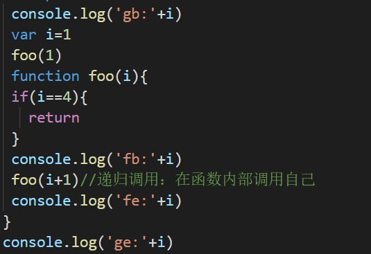 

 

 

### 12.作用域与作用域链

（1）理解： - 就是一块“地盘”，，一个代码段所在的区域 

​                       -它是静态的（相对于上下文对象），在编写代码时就确定了

（2）分类：全局作用域、函数作用域、没有块作用域（ES6有块作用域）

（3）作用：隔离变量，不同作用域下同名变量不会有冲突

  

 

#### 1.作用域与执行上下文的区别

（1）- 全局作用域之外，每个函数都会创建自己的作用域，作用域在函数定义时就已经确定了，

​          而不是在函数调用 时

​          - 全局执行上下文环境是在全局作用域确定之后，js代码马上执行之前确

​          - 函数执行上下文环境是在调用函数时，函数体执行代码之前创建

（2）- 作用域是静态的，只要函数定义好了就一直存在，且不会再变化

​          - 执行上下文是动态的，调用函数时创建，函数调用结束时上下文环境就会被自动释放

（3）联系： - 执行上下文环境（对象）是从属于所在的作用域

​                     - 全局上下文环境==》全局作用域

​                    - 函数上下文环境==》对应的函数使用域

#### 2.作用域链

（1）理解：多个上下级关系的作用域形成的链，它的方向是从下向上的（从内到外）

​                     查找变量时就是沿着作用域链来查找的

（2）查找一个变量的查找规则：

- 在当前作用域下的执行上下文中查找对应的属性，如果有，则直接返回，否则进入2
- 在上一级作用域的执行上下文中查找对应的属性，如果有，则直接返回，否则进入3
- 再次执行2的相同操作，直到全局作用域，如果还找不到就抛出找不到的异常

#### 3.面试题

 

### 13.闭包

（1）如何产生闭包？

当一个嵌套的内部（子）函数引用了嵌套的外部（父）函数的变量（函数）时，就产生了闭包

（2）产生闭包的条件：

​         --函数嵌套

​         --内部函数引用了外部函数的数据（变量\函数）

（3）闭包到底是什么？ 

- 使用chrome调试查看

- 理解一：闭包是嵌套的内部函数（绝大部分人）

- 理解二：包含被引用变量（函数）的对象（极少数人）

  注意：闭包存在于嵌套的内部函数中 

   

   

#### 1.常见的闭包

 

#### 2.闭包的作用

（1）使用函数内部的变量在函数执行完后，仍然存活在内存中（延长了局部变量的生命周期）

（2）让函数外部可以操作（读写）到函数内部的数据（变量\函数）

 

 

#### 3.闭包的生命周期

（1）产生：在嵌套内部函数定义执行完时就产生了（不是在调用）

（2）死亡：在嵌套的内部函数成为垃圾对象时

#### 4.闭包的应用（自定义JS模块）

（1）具有特定功能的JS文件

（2）将所有的数据和功能都封装在一个函数内部（私有的）

（3）只向外暴露一个包含n个方法的对象或函数

（4）模块的使用者，只需要通过模块暴露的对象调用方法来实现对应的功能

##### 第一种方法：

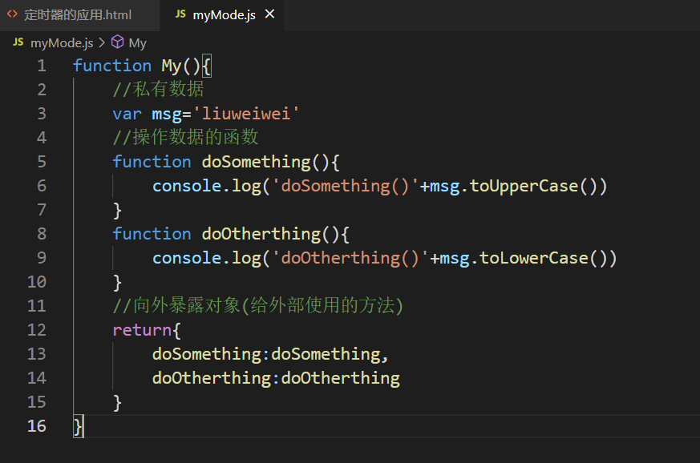 

 

##### 第二种方法：

 

 

#### 5.闭包的缺点及解决

（1）缺点：函数执行完后，函数内的局部变量没有释放，占用内存时间会变长；容易造成内存泄漏

（2）解决：能不用闭包就不用；及时释放

 

#### 6.内存溢出与泄露

（1）内存溢出：一种程序运行出现的错误；当程序运行需要的内存超过了剩余的内存时，

​                              就会抛出内存溢出的错误

 

（2）内存泄漏：占用的内存没有及时释放；内存泄漏积累多了就容易导致内存溢出；

​         常见的内存泄漏：意外的全局变量、没有及时清理的计时器或回调函数、闭包

    

#### 7.面试题

 

 

#### 8.自定义JS文件

 

#### 9.终极面试题

 

### 14.对象创建模式

#### 方式1：Object构造函数模式

套路：先创建空Object对象，再动态添加属性\方法

适用场景：起始时不确定对象内部数据

问题：语句太多

  

#### 方式2：对象字面量模式

套路：使用{}创建对象，同时指定属性\方法

适用场景：起始时对象内部数据是确定的

问题：如果创建多个对象，有重复代码

 

#### 方式3：工厂模式

套路：通过工厂函数动态创建对象并返回

适用场景：需要创建多个对象

问题：对象没有一个具体的类型，都是Object类型

 

#### 方式4：自定义构造函数模式

套路：自定义构造函数，通过new创建对象

适用场景：需要创建多个类型确定的对象

问题：每个对象都有相同的数据，浪费内存

 

####  方式5：构造函数+原型的组合模式

套路：自定义构造函数，属性在函数中初始化，方法添加到原型上

适用场景：需要创建多个类型确定的对象

 

### 15.继承模式

#### 方式1：原型链继承

套路：（1）定义父类型构造函数  （2）给父类型的原型添加方法

​           （3）定义子类型的构造函数    （4）创建父类型的对象赋值给子类型的原型

​           （5）将子类型原型的构造属性设置为子类型    （6）给子类型原型添加方法

​          （7）创建子类型的对象：可以调用父类型的方法

关键：子类型的原型为父类型的一个实例对象

 

#### 方式二：借用构造函数继承（假的）

套路：（1）定义父类型构造函数      （2）定义子类型构造函数    

​            （3）在子类型构造函数中调用父类型构造

关键：在子类型构造函数中通用call（）调用父类型构造函数 

 

#### 方式三：组合继承

原型链+借用构造函数的组合继承

1.利用原型链实现对父类型对象的方法继承

2.利用super（）借用父类型构建函数初始化相同属性 

 

### 16.进程与线程

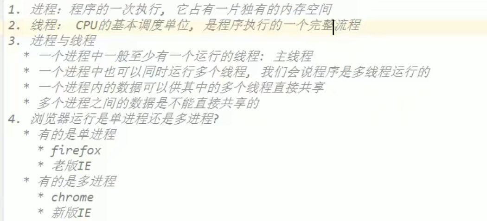 

 

### 17.JS是单线程进行的

  

### 18.浏览器内核

   

### 19.事件处理机制

 

