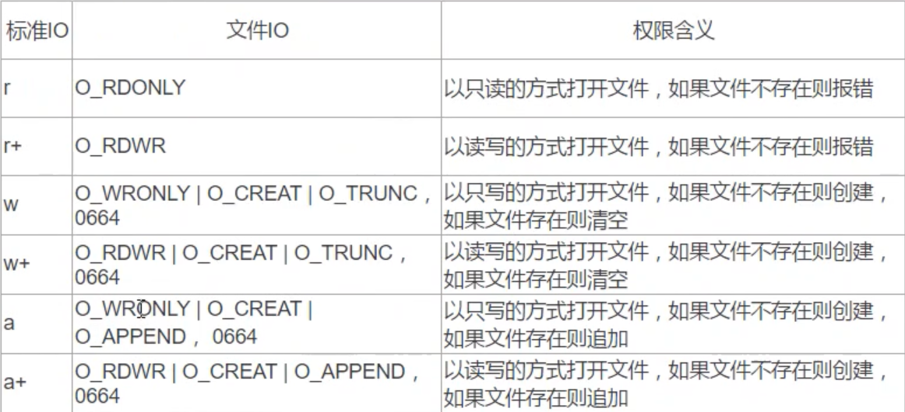
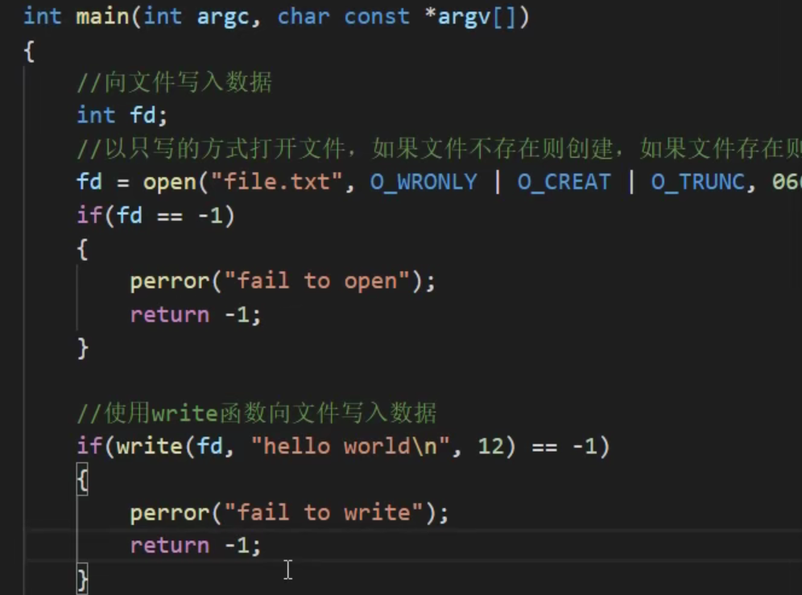

#                      Linux高级程序设计

## 文件描述符

文件描述符是非负整数。打开现存文件或新建文件时，系统（内核）会返回一个文件描述符，文件描述符用来指定已打开的文件。

在系统调用（文件IO）中，文件描述符对文件起到标识作用，如果要操作文件，就是对文件描述符的操作。

当一个程序运行或者一个进程开启时，系统会自动创建三个文件描述符，分别是 

0（标准输入） 1（标准输出）  2（标准输出出错）

 

### 文件IO的文件描述符和标准IO的文件指针的对应关系

文件IO      标准IO

  0              stdin

  1              stdout

  2              stderr

如果自己打开文件，会返回文件描述符，而文件描述符一般按照从小到大依次创建的顺序

## open函数

   

 

 

## 文件IO和标准IO权限对比

 

## 函数调用出错后输出错误信息

（1）通过全局变量   error

​         #include<errno.h>

​          errno是一个全局变量，当函数调用失败后，可以通过errno获取错误码

（2）通过一个函数   perror

​          #include<stdio.h>

​             void   perror(const   char  *s);

​          功能：输出函数调用失败的错误信息
​          参数（s）：打印错误信息的提示消息，无返回值

## close函数

    

## 测试文件描述符值的规律

 

 

 

 

## write函数

 

  

### 向终端写数据

 

### 向文件写数据

 

 

 

## read函数

 

 

### 从终端读取数据

 

 

 

### 从文件读取数据

 

 

## remove函数（库函数）

 

## 系统调用和库函数

### 库函数由两类函数组成

（1）不需要调用系统调用

 不需要切换到内核空间即可完成函数全部功能，并且将结果反馈给应用程序，如strcpy、bzero等字符串操作函数。  

（2）需要调用系统调用

需要切换到内核空间，这类函数通过封装系统调用去实现相应功能，如printf、fread等

###   库函数与系统调用的关系

系统提供的很多功能都必须通过系统调用才能实现

 

系统调用是需要时间的，程序中频繁的使用系统调用会降低程序的使用效率

当运行内核代码时，CPU工作在内核状态，在系统调用发生前需要保存用户的栈和内存环境，然后转入内核态工作，系统调用结束后，又要切换回用户态，这种环境的切换会消耗很多时间

库函数访问文件的时候根据需要，设置不同类型的缓冲区，从而减少了直接调用IO系统调用的次数，提高了访问效率

 

 

总结：大多数库函数的本质也是系统调用，只不过库函数有了缓冲区，用于减少系统调用的次数

## 进程

### 进程的定义

程序：程序是存放在存储介质（磁盘空间）上的一个可执行文件

进程：进程是程序的执行实例，包括程序计数器、寄存器和变量的当前值。程序是静态的，进程是动态的，实在内存中运行的

程序是一些指令的有序集合，而进程是程序执行的过程（是程序的一次执行过程）

进程的状态是变化的，其包括进程的创建、调度、消亡

只要程序运行，此时就是进程，程序每运行一次，就会创建一个进程

### 进程的状态及转换

进程整个生命周期可以简单划分为三种状态

就绪态：进程已经具备执行的一切条件，正在等待分配CPU的处理时间

执行态：该进程正在占用CPU运行

等待态：进程因不具备某些执行条件而暂时无法继续执行的状态

###   	进程的调度进制

​      **时间片轮转，上下文切换**

多进程不是说一个进程执行完再执行另一个进程，而是交替执行的，一个进程执行一段时间，然后下一个进程再执行一段时间，依次类推，所有进程执行完之后再回到第一个进程继续执行，以次类推。 

### 进程控制块

进程控制块就是用于保存一个进程信息的结构体，又称之为PCB

### 进程号

每个进程都由一个进程号来标识，其类型为pid_t，进程号的范围：0~32767

进程号是由操作系统随机给当前进程分配的，不能自己控制；进程号总是唯一的,但进程号可以重用，当一个进程终止后，其进程号就可以再次使用了

