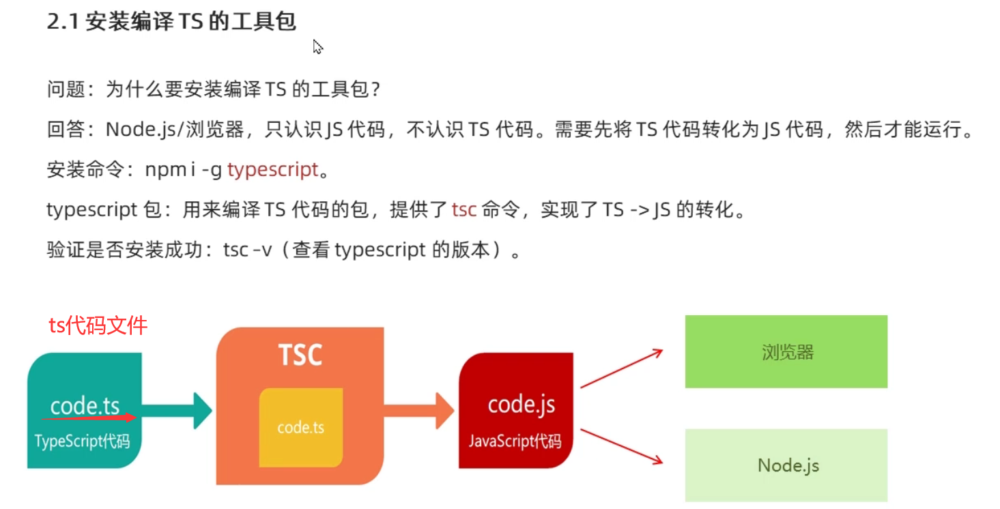
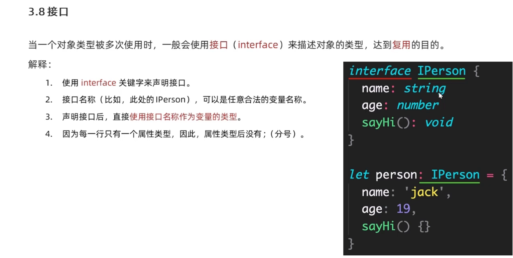
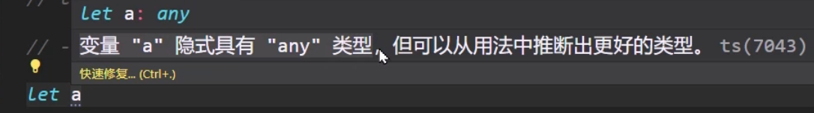
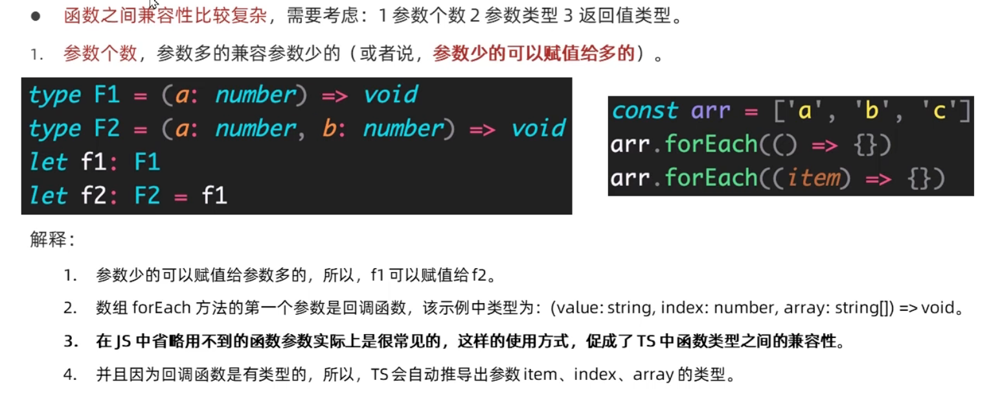

## 1.Typescript介绍

 

 

## 2.Typescript初体验

 

 

 

## 3.Typescript常用类型

 

 

 

### 1.原始类型

 

### 2.数组类型和联合类型

 

 

### 3.类型别名（type）

 

### 4.函数类型

#### 设定函数参数和返回值的类型

 

 

#### 是否有返回值

**如果函数没有返回值，那么，函数返回值类型为：void**

 

#### 是否传参

 

 

### 5.对象类型

 

**写法一**

 

**写法二**

 

#### 可选属性

 

### 6.接口

#### 初识

 

#### 接口（interface）与type之间的对比

 

#### 接口之间的继承

 

 

### 7.元祖

 

### 8.类型推论

 

### 9.类型断言

 

### 10.字面量类型

 

 

### 11.枚举

 

#### 数字枚举

 

#### 字符串枚举

 

#### 枚举的特性

 

### 12.any类型

 

**（1）声明变量不提供类型也不提供默认值（可以传入任意的值，代码不会有任何的错误）**

 

 

**（2）函数参数不加类型（可以传入任意的值，代码不会有任何的错误）**

 

 

### 13.typeof运算符

 

 

## 4.Typescript高级类型

### 1.class类

#### 1.class类的基本使用

 

 

#### 2.class类的构造函数

 

 

#### 3.class类的实例方法

**方法的类型注解（参数和返回值）与函数用法相同**

 

#### 4.class类的继承

##### 1.extends继承

**类继承的两种方式：1.extends（继承父类）2.implements（实现接口）**

**说明：JS中只有extends，而implements是TS提供的**

 

**解释：**

**（1）通过extends关键字实现继承**   

**（2）子类Dog继承父类Animal，则Dog的实例对象dog就同时具有了父类Animal和子类Dog的所有属性和方法**

##### 2.implements继承

 

**解释：**

**（1）通过implements关键字让class实现接口**   

**（2）Person类实现接口Singable意味着，Person类中必须提供Singable接口中指定的所有方法和属性**

### 2.类成员可见性

#### 1.public（公有成员）

 

#### 2.protected（受保护成员）

**protected：表示受保护的，仅对其声明所在类和子类中（非实例对象）可见**

 

**解释：**

**（1）在类属性或方法前面添加protected关键字，来修饰该属性或方法是受保护的**

**（2）在子类的方法内部可以通过this来访问父类中受保护成员，但是，对实例不可见！**

#### 3.private（私有成员）

 

#### 4.readly（只读修饰符）

 

 

 

 

### 3.类型兼容性

#### 1.类与类之间的兼容性

 

 

 

#### 2.接口之间的兼容性

**接口之间的兼容性，类似于class，并且，class和interface之间也可以兼容**

**（成员多的可以赋值给成员少的）**

 

 

#### 3.函数之间的兼容性

##### 1.根据参数个数判断

 

##### 2.根据参数类型判断	 

 

 

##### 3.根据返回值类型判断

 

 	

### 4.交叉类型

 

 

**交叉类型（&）和接口继承（extends）的对比**

 

### 5.泛型

#### 1.调用泛型函数

 

 

#### 2.简化调用泛型函数

 

#### 3.泛型约束

##### **1.指定更加具体的类型**

 

##### **2.添加约束**

 

 

#### 4.类型变量之间的约束

  

 

#### 5.泛型接口

 

 

 

#### 	6.泛型类

 

 

#### 7.泛型工具类

 

##### 1.Partial（将所有属性变为可选)

 

 

##### 2.Readonly（只读）

 

 

##### 3.Pick（构造新类型）

 

##### 4.Record构造一个对象类型

 

 

### 6.索引签名类型

 

 

**数组中使用索引签名类型**

 

 

### 7.映射类型

#### 1.基本书写规则

 

 

#### 2.根据对象类型来创建

 

 

#### 3.Partial 的实现

 

#### 4.索引查询类型

 

 

#### 5.同时查询多个索引的类型

 

## 5.Typescript类型声明文件

### 1.概述

 

### 2.TS中的两种文件类型（.ts文件 和 .d.ts文件）

 

**index.ts文件**

 

**index.d.ts文件**

 

### 3.类型声明文件的的使用声明

