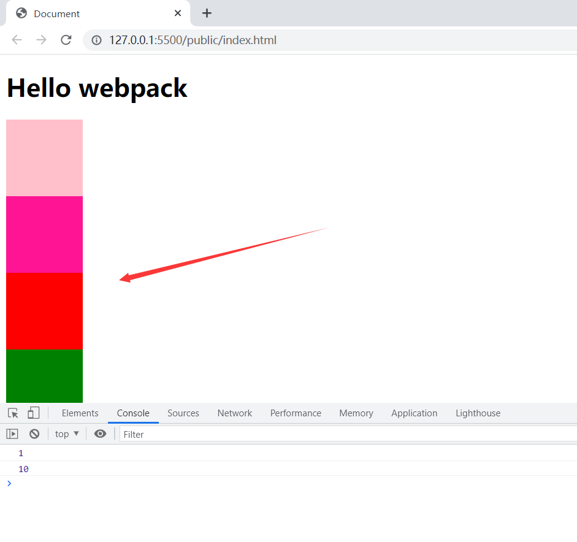

# **Webpack简介**

## 1. Webpack是什么

Webpack是一种前端资源构建工具，一个静态模块打包器（module bundler）。在Webpack看来，前端的所有资源文件（js/json/css/img/less/...)都会作为模块处理。

它将根据模块的依赖关系进行静态分析，打包生成对应的静态资源（bundle）

 

 

## 2. Webpack的五个核心概念

### 1.Entry

**入口（Entry）指示 Webpack以哪个文件为入口起点开始打包，分析构建内部依赖图。**

### 2.Output

**输出(Output)指示webpack打包后的资源bundles输出到哪里去，以及如何命名。**

### 3.Loader 

**webpack本身只能处理js、json等资源，其他资源需要借助oader，webpack才能解析，Loaderr让webpack能够去处理那些非javascript文件（webpack自身只能理解javascript）**

### 4.Plugins

**插件（plugins）可以用于执行范围更广的任务。插件的范围包括，从打包优化和压缩，一直到重新定义环境中的变量等。**

### 5.Mode

**模式(mode)指示webpack使用相应模式的配置**

**开发者模式：development     生产者模式：production**

 

## 3.功能介绍

 

## 4.开始使用

### 1.资源目录

 

### 2.创建文件

 

 

 

 

 

### 3.下载依赖

 

 

 

 

### 4.启用webpack

 

 

 

 

 

 

### 5.观察输出文件

**默认webpack会将文件打包输出到dist目录下，我们查看dist目录下文件情况就好了**

 

 

 

## 5.开发模式介绍

 

## 6.处理CSS资源

安装css-loader和style-loader

```bash
npm install --save-dev css-loader
```

 

 

 

 

 

 

## 7.处理less资源

 

 

 

 

 

 

## 8.处理sass资源

 

 

 

 

 

 



## 9.处理stylus资源

 

 

 

 

 

 

## 10.处理图片资源


