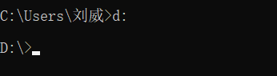

## 1.命令行窗口

 

在cmd命令行窗口里面创建文件夹hello

 

 

 

在文件夹里创建hello.txt，并输入文本内容

如果不是在hello文件夹的目录下打开hello.txt，则会报错

 

在hello文件夹下才可以打开hello.txt

 

如果hello.txt需要经常打开，但是又不想在hello文件夹下打开，就是那种无论在哪个目录下随时用随时打开的话，需要在环境变量中进行配置

 

 

 

 

想进入d盘的话就直接 d:

 

## 2.进程和线程

 

## 3.使用node执行js文件

 

 

## 4.fs文件系统模块

### 1.什么是fs文件系统模块

 

### 2.读取指定文件中的内容

#### 1.fs.readFile（）的语法格式

 

#### 2.fs.readFile（）的示例代码

###  

####   

#### 3.判断文件是否读取成功 

 

 

### 3.向指定的文件写入内容

#### 1.fs.writeFile()方法

 

#### 2.fs.writeFile()的示例代码

 

 

 

### 4.练习---考试成绩整理

#### 1.需求

 

#### 2.核心步骤

 

 

 

 

### 5.路径动态拼接问题

 

 

 

#### 解决方法

 

 

 

 

## 2.path路径模块

### 1.什么是path模块

 

### 2.path.join()的语法格式

 

 

注意：今后凡是涉及到路径拼接的操作，都要使用path.join（）方法进行处理。不要直接使用+进行字符串的拼接

 

### 3.获取路径中的文件名

#### 1.pase.basename（）的语法格式

 

 

### 4.获取路径中的文件扩展名

 

#### 1.path.extname()代码示例

 

 

### 5.综合案例

#### 1.案例要实现的功能

 

#### 2.案例的实现步骤

 

##### 1.步骤1：导入需要的模块并创建正则表达式

 

##### 2.使用fs模块读取需要被处理的html文件

  

##### 3.自定义resolveCSS方法

