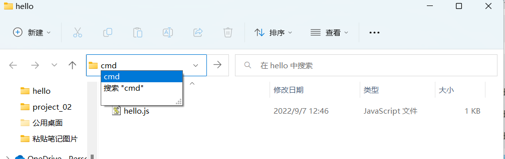
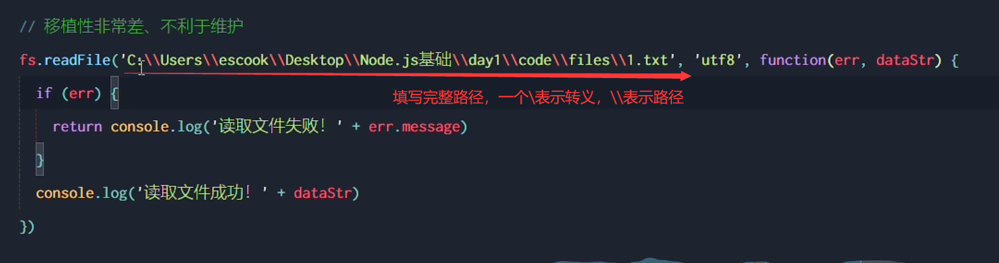
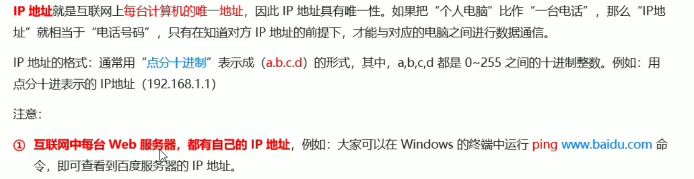
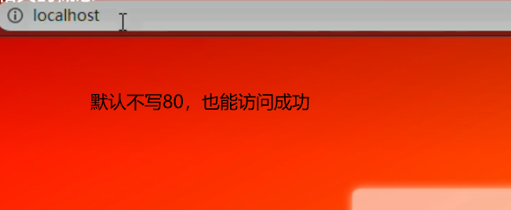
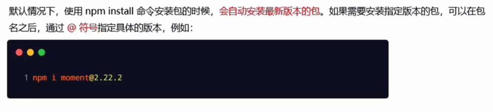
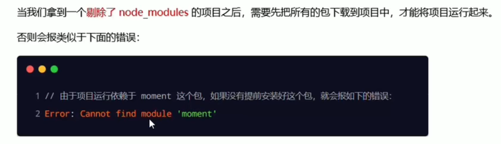
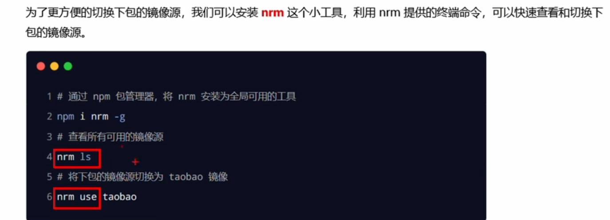
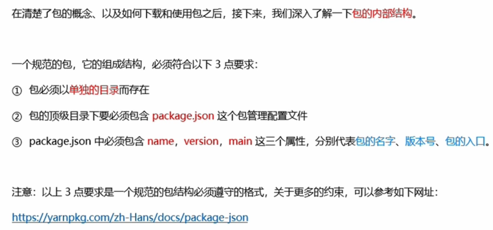
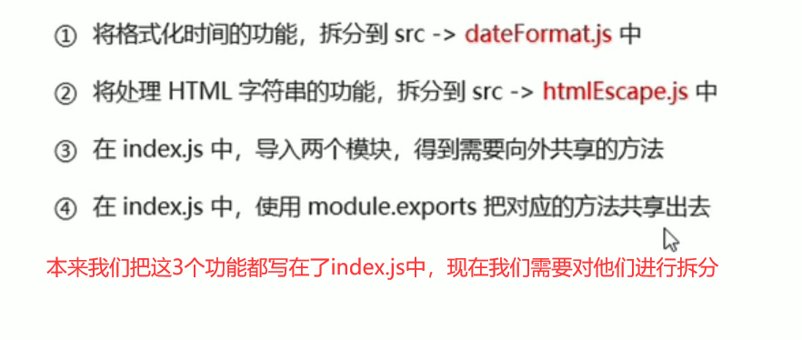

## 1.命令行窗口

 

在cmd命令行窗口里面创建文件夹hello

 

 

 

在文件夹里创建hello.txt，并输入文本内容

如果不是在hello文件夹的目录下打开hello.txt，则会报错

 

在hello文件夹下才可以打开hello.txt

 

如果hello.txt需要经常打开，但是又不想在hello文件夹下打开，就是那种无论在哪个目录下随时用随时打开的话，需要在环境变量中进行配置

 

 

 

 

想进入d盘的话就直接 d:

 

## 2.进程和线程

 

## 3.使用node执行js文件

 

 

## 4.fs文件系统模块

### 1.什么是fs文件系统模块

 

### 2.读取指定文件中的内容

#### 1.fs.readFile（）的语法格式

 

#### 2.fs.readFile（）的示例代码

###  

####   

#### 3.判断文件是否读取成功 

 

 

### 3.向指定的文件写入内容

#### 1.fs.writeFile()方法

 

#### 2.fs.writeFile()的示例代码

 

 

 

### 4.练习---考试成绩整理

#### 1.需求

 

#### 2.核心步骤

 

 

 

 

### 5.路径动态拼接问题

 

 

 

#### 解决方法

 

 

 

 

## 5.path路径模块

### 1.什么是path模块

 

### 2.path.join()的语法格式

 

 

注意：今后凡是涉及到路径拼接的操作，都要使用path.join（）方法进行处理。不要直接使用+进行字符串的拼接

 

### 3.获取路径中的文件名

#### 1.pase.basename（）的语法格式

 

 

### 4.获取路径中的文件扩展名

 

#### 1.path.extname()代码示例

 

 

### 5.综合案例

#### 1.案例要实现的功能

 

#### 2.案例的实现步骤

 

##### 1.步骤1：导入需要的模块并创建正则表达式

 

##### 2.使用fs模块读取需要被处理的html文件

  

##### 3.自定义resolveCSS（）方法

 

##### 4.自定义resolveJS( )方法

  

##### 5.自定义resolveHTML方法( )

#### 3.案例的两个注意点

 

##  6.http模块

### 1.什么是http模块

 

### 2.进一步理解http模块的作用

 

将自己的电脑变为服务器，装Apache软件

 

在自己的电脑上对外提供web服务

 

 

 

 

 

### 3.服务器相关的概念

#### 1.IP地址

 

 

 

 

#### 2.域名和域名服务器

  

#### 3.端口号

 

 

 

### 4.创建最基本的web服务器

#### 1.基本步骤

  

 

#### 2.req请求对象

 

 

如果想换成POST方法请求，则需要打开postman

 

 

 

 

#### 3.res响应对象

 

#### 4.解决中文乱码问题

 

 

### 5.根据不同的url响应不同的html内容

#### 1.核心实现步骤

 

#### 2.动态响应内容

  

 

### 6.实现clock时钟的web服务器

#### 1.核心思路

####   

#### 2.实现步骤

 

##### 步骤1--导入需要的模块

####  

#####  步骤2--创建基本的服务器

 

##### 步骤3--将资源的请求url地址映射为文件的存放路径

 

##### 步骤4--读取文件的内容并响应给客户端

  

##### 步骤5--优化资源的请求路径

 

## 7.模块化的基本概念

### 1.什么是模块化

 

#### 1.编程领域中的模块化

 

#### 2.模块化规范

###  2.Node.js中的模块化

#### 1.模块的分类

 

#### 2.加载模块

 

注意：在使用require加载用户自定义模块期间，可以省略.js后缀名

### 3.Node.js中的模块作用域

#### 1.什么是模块作用域

 

#### 2.模块作用域的好处

 

 

### 4.向外共享模块作用域中的成员

 

#### 1.module.exports( )对象

 

 

 

  

#### 2.共享成员时的注意点

 

#### 3.exports对象

 

#### 4.exports和module.exports的使用误区

 

 

 

#### 5.Node.js中的模块化规范

 

## 8. 包

### 1.什么是包

 

#### 2.包的来源

 

#### 3.为什么需要包

 

#### 4.从哪里下载

 

#### 5.如何下载包

 

### 2.npm初体验

#### 1.格式化时间的传统做法

 

 

#### 2.格式化时间的高级做法

 

#### 3.项目中安装包的命令

 

 

#### 4.怎么查看包的用法（文档）

 

#### 5.初次装包后多了哪些文件

 

#### 6.安装指定版本的包

 

#### 7.包的语义化版本规范

 

### 3.npm与包

#### 1.包管理配置文件

 

#### 2.多人协作的问题

 

  

#### 3.快速创建package.json

 

#### 4.dependencies节点

 

#### 5.一次性安装所有的包

 

#### 6.一次性安装所有的包

 

#### 7.卸载包

 

#### 8.devDependencies节点

 

#### 9.解决npm下包慢的问题

##### 1.为什么下包速度慢

 

##### 2.淘宝NPM镜像服务器

 

##### 3.切换npm下包的镜像源

 

##### 4.nrm

 

 

#### 10.包的分类

##### 1.项目包

#####  

##### 2.全局包

 

 

##### 3.i5ting_toc

 

##### 4.规范的包结构

 

#### 11.开发属于自己的包

##### 1.需要实现的功能

 

 

 

 

##### 2.初始化包的基本结构

   

 

##### 3.初始化package.json

 

##### 4.在index.js中定义格式化时间的方法

 

 

##### 5.在index.js中定义转义HTML的方法

 

 

##### 6.在index.js中定义还原HTML的方法

 

 

##### 7.将不同的功能进行模块化拆分

 

**dataFormats**

 

**htmlEscape.js**

 

**index.js**

 

**lww测试.js**

 

**输出结果**

 

##### 8.编写包的说明文档

 

 

#### 12.发布包

##### 1.注册npm账号

 

 