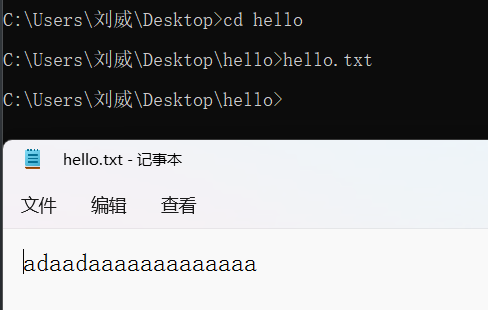
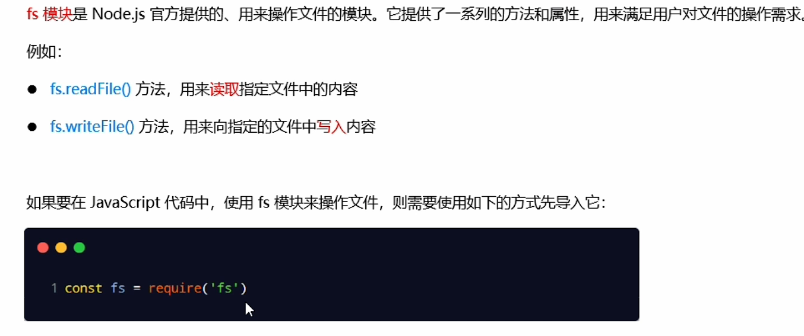
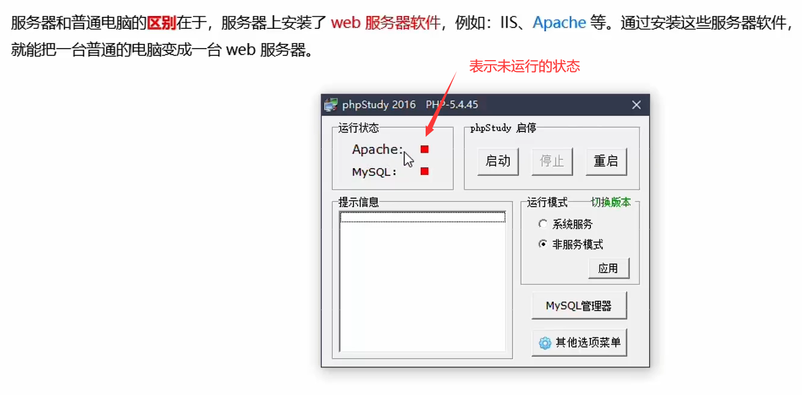
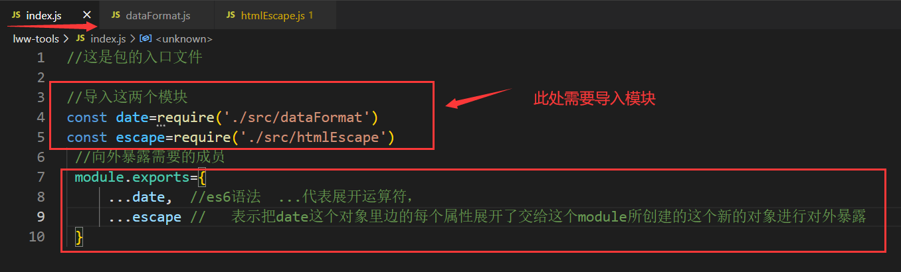
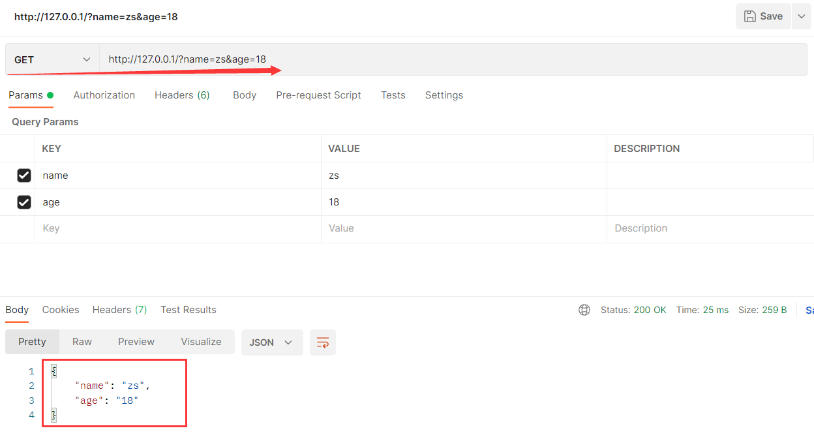
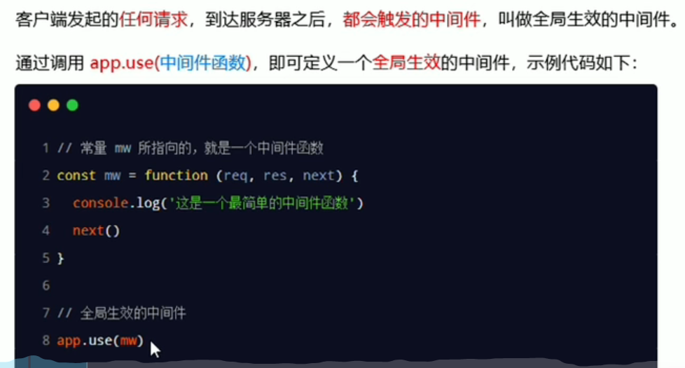
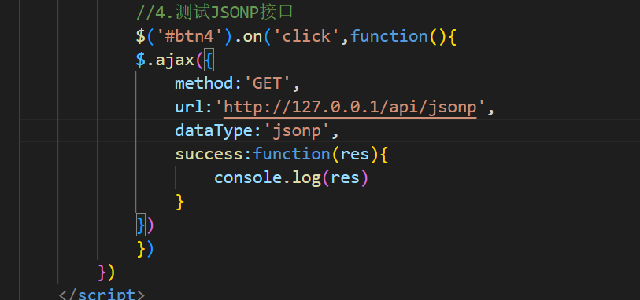
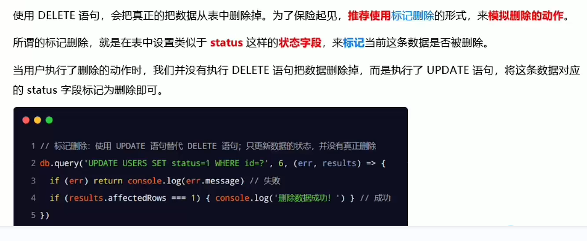
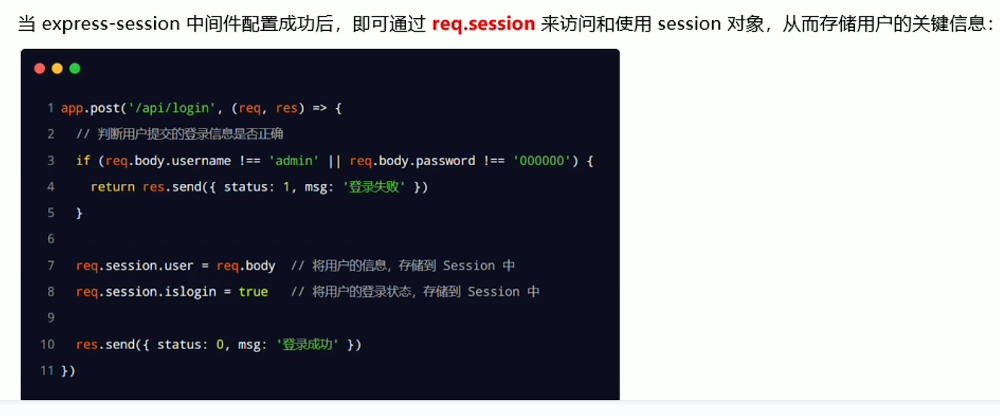

## 1.命令行窗口

 

在cmd命令行窗口里面创建文件夹hello

 

 

 

在文件夹里创建hello.txt，并输入文本内容

如果不是在hello文件夹的目录下打开hello.txt，则会报错

 

在hello文件夹下才可以打开hello.txt

 

如果hello.txt需要经常打开，但是又不想在hello文件夹下打开，就是那种无论在哪个目录下随时用随时打开的话，需要在环境变量中进行配置

 

 

 

 

想进入d盘的话就直接 d:

 

## 2.进程和线程

 

## 3.使用node执行js文件

 

 

## 4.fs文件系统模块

### 1.什么是fs文件系统模块

 

### 2.读取指定文件中的内容

#### 1.fs.readFile（）的语法格式

 

#### 2.fs.readFile（）的示例代码

###  

####   

#### 3.判断文件是否读取成功 

 

 

### 3.向指定的文件写入内容

#### 1.fs.writeFile()方法

 

#### 2.fs.writeFile()的示例代码

 

 

 

### 4.练习---考试成绩整理

#### 1.需求

 

#### 2.核心步骤

 

 

 

 

### 5.路径动态拼接问题

 

 

 

#### 解决方法

 

 

 

 

## 5.path路径模块

### 1.什么是path模块

 

### 2.path.join()的语法格式

 

 

注意：今后凡是涉及到路径拼接的操作，都要使用path.join（）方法进行处理。不要直接使用+进行字符串的拼接

 

### 3.获取路径中的文件名

#### 1.pase.basename（）的语法格式

 

 

### 4.获取路径中的文件扩展名

 

#### 1.path.extname()代码示例

 

 

### 5.综合案例

#### 1.案例要实现的功能

 

#### 2.案例的实现步骤

 

##### 1.步骤1：导入需要的模块并创建正则表达式

 

##### 2.使用fs模块读取需要被处理的html文件

  

##### 3.自定义resolveCSS（）方法

 

##### 4.自定义resolveJS( )方法

  

##### 5.自定义resolveHTML方法( )

#### 3.案例的两个注意点

 

##  6.http模块

### 1.什么是http模块

 

### 2.进一步理解http模块的作用

 

将自己的电脑变为服务器，装Apache软件

 

在自己的电脑上对外提供web服务

 

 

 

 

 

### 3.服务器相关的概念

#### 1.IP地址

 

 

 

 

#### 2.域名和域名服务器

  

#### 3.端口号

 

 

 

### 4.创建最基本的web服务器

#### 1.基本步骤

  

 

#### 2.req请求对象

 

 

如果想换成POST方法请求，则需要打开postman

 

 

 

 

#### 3.res响应对象

 

#### 4.解决中文乱码问题

 

 

### 5.根据不同的url响应不同的html内容

#### 1.核心实现步骤

 

#### 2.动态响应内容

  

 

### 6.实现clock时钟的web服务器

#### 1.核心思路

####   

#### 2.实现步骤

 

##### 步骤1--导入需要的模块

####  

#####  步骤2--创建基本的服务器

 

##### 步骤3--将资源的请求url地址映射为文件的存放路径

 

##### 步骤4--读取文件的内容并响应给客户端

  

##### 步骤5--优化资源的请求路径

 

## 7.模块化的基本概念

### 1.什么是模块化

 

#### 1.编程领域中的模块化

 

#### 2.模块化规范

###  2.Node.js中的模块化

#### 1.模块的分类

 

#### 2.加载模块

 

注意：在使用require加载用户自定义模块期间，可以省略.js后缀名

### 3.Node.js中的模块作用域

#### 1.什么是模块作用域

 

#### 2.模块作用域的好处

 

 

### 4.向外共享模块作用域中的成员

 

#### 1.module.exports( )对象

 

 

 

  

#### 2.共享成员时的注意点

 

#### 3.exports对象

 

#### 4.exports和module.exports的使用误区

 

 

 

#### 5.Node.js中的模块化规范

 

## 8. 包

### 1.什么是包

 

#### 2.包的来源

 

#### 3.为什么需要包

 

#### 4.从哪里下载

 

#### 5.如何下载包

 

### 2.npm初体验

#### 1.格式化时间的传统做法

 

 

#### 2.格式化时间的高级做法

 

#### 3.项目中安装包的命令

 

 

#### 4.怎么查看包的用法（文档）

 

#### 5.初次装包后多了哪些文件

 

#### 6.安装指定版本的包

 

#### 7.包的语义化版本规范

 

### 3.npm与包

#### 1.包管理配置文件

 

#### 2.多人协作的问题

 

  

#### 3.快速创建package.json

 

#### 4.dependencies节点

 

#### 5.一次性安装所有的包

 

#### 6.一次性安装所有的包

 

#### 7.卸载包

 

#### 8.devDependencies节点

 

#### 9.解决npm下包慢的问题

##### 1.为什么下包速度慢

 

##### 2.淘宝NPM镜像服务器

 

##### 3.切换npm下包的镜像源

 

##### 4.nrm

 

 

#### 10.包的分类

##### 1.项目包

#####  

##### 2.全局包

 

 

##### 3.i5ting_toc

 

##### 4.规范的包结构

 

#### 11.开发属于自己的包

##### 1.需要实现的功能

 

 

 

 

##### 2.初始化包的基本结构

   

 

##### 3.初始化package.json

 

##### 4.在index.js中定义格式化时间的方法

 

 

##### 5.在index.js中定义转义HTML的方法

 

 

##### 6.在index.js中定义还原HTML的方法

 

 

##### 7.将不同的功能进行模块化拆分

 

**dataFormats**

 

**htmlEscape.js**

 

**index.js**

 

**lww测试.js**

 

**输出结果**

 

##### 8.编写包的说明文档

 

 

#### 12.发布包

##### 1.注册npm账号

 

 

 

##### 2.登录npm账号

 

使用nrm ls查看所有的镜像源，再使用nrm use npm切换为npm的官方服务器，然后输入npm login

 

##### 3.把包发布到npm上

 

 

  

#####  4.删除已经发布的包

 

 

## 9.模块的加载机制

### 1.优先从缓存中加载

 

在03.自定义模块里面console.log（'ok'）

 

在04.test里面require3次

 

但是终端里面只输出一次ok，原因是我们第一次require03模块时我们就已经把该模块进行缓存了  

 

### 2.内置模块的加载机制

 

### 3.自定义模块的加载机制

 

 

 

 

 

 

如果不写文件的扩展名就会按照确切的文件名进行加载

 

如果将test文件删除掉，则输出

 

如果将test.js文件也删除，则输出

 

如果test.json也删除，则输出

 

如果test.node也删除，则输出

 

### 4.第三方模块的加载机制

 

### 5.目录作为模块

 

  

 

 

 

 

## 10.Express

### 1.Express简介

#### 1.什么是Express

 

#### 2.进一步理解Express

 

#### 3.Express能做什么

 

### 2.安装

 

 

### 3.创建基本的Web服务器

 

### 4.监听GET请求

 

### 5.监听POST请求

 

### 6. 把内容响应给客户端

 

 

打开postman

 

  

### 7.获取URL中携带的查询参数

 

 

 

### 8.获取URL中的动态参数

 

 

 

 

 

### 9.拖管静态资源

#### 1.express.static()

 

 

 

#### 2.拖管多个静态资源目录

 

#### 3.挂载路径前缀

 

## 11.nodemon

### 1.为什么要使用nodemon

 

### 2.安装

### 3.使用nodemon

 

## 12.Express路由

### 1.路由的概念

#### 1.现实生活中的路由

**广义上来讲，路由就是映射关系**

 

#### 2.Express中的路由

 

#### 3.Express中的路由的例子

 

#### 4.路由匹配的过程

 

### 2.路由的使用

#### 1.最简单的用法

 

#### 2.模块化路由

 

#### 3.创建路由模块

 

#### 4.注册路由模块

 

注意：app.use的函数的作用，就是来注册全局中间件

 

 

 

#### 5.为路由模块添加前缀

 

 

 

 

## 13.Express中间件

### 1.中间件的概念

中间件，特指业务流程的中间处理环节

#### 1.现实生活中的例子

 

#### 2.Express中间件的调用流程

 

#### 3.Express中间件的格式

 

#### 4.next函数的作用

 

#### 5.定义中间件函数

 

#### 6.全局生效的中间价

 

#### 7.定义全局中间件的简化形式

 

### 2.中间件的作用

 

我们在上游的中间件中获取到请求到达服务器的时间，然后在下游可以进行调用

 

#### 1.定义多个全局中间件

 

 

 

#### 2.局部生效的中间件

 

 

 

 

 

 

#### 3.定义多个局部中间件

 

 

 

 

#### 4.了解中间件的5个使用注意项

 

### 3.中间件的分类

 

#### 1.应用级别的中间件

 

#### 2.路由级别的中间件

 

#### 3.错误级别的中间件

 

 

 

 

 

#### 4.Express的内置中间件

 

**express.json的案例**

 

 

**express.urlencoded的案例**

 

**extended: true**

 

 

**extended: false**

 

 

 

#### 5.第三方的中间件

 

 

 

### 4.自定义中间件

#### 1.需求描述与实现步骤

 

 

#### 2.监听req的data事件

 

 

#### 3.监听req的end事件

 

 

 

#### 4.使用querrystring模块解析请求体数据

 

 

  

#### 5.将解析出来的数据对象挂载为req.body

 

 

  

#### 6.将自定义中间件封装为模块

 

 

 

### 5.使用Express写接口

#### 1.创建基本的服务器

 

#### 2.创建API路由模块

 

#### 3.编写GET接口

 

 

 

#### 4.编写POST接口

  

 

 

### 6.CORS跨域资源共享

#### 1.接口的跨域问题

 

 

 

 

#### 2.使用CORS中间件解决跨域问题

 

 

 

 

#### 3.什么是CORS

 

#### 4.CORS的注意事项

 

####  5.CORS响应头部-Access-Control-Allow-Origin

 

 

#### 6.CORS响应头部-Access-Control-Allow-Headers

 

#### 7.CORS响应头部-Access-Control-Allow-Methods

 

#### 8.CORS请求的分类

 

#####  简单请求

 

##### 预检请求

 

##### 区别

  

 

 

 

### 7.JSONP接口

#### 1.回顾JSONP的概念与特点

 

#### 2.创建JSONP接口的注意事项

 

#### 3.实现JSONP接口的步骤

 

 

#### 4.在网页中使用JQuery发起JSONP请求

 

 

 

 

## 14.数据库

### 1.基本概念

#### 1.什么是数据库

  

#### 2.常见的数据库及分类

 

 

#### 3.传统型数据库的数据组织结构

 

**Excel的数据组织结构**

 

 

#### 4.实际开发中库、表、行、字段的关系

 

### 2.安装并配置MySQL

#### 1.需要安装的相关软件

 

 

### 3.使用MySQL   Workbench管理数据库

 

#### 1.了解主界面的组成部分

  

 

#### 2.创建数据库

 

 

#### 3.创建数据表

 

 

 

 

 

#### 4.向表中写入数据

 

 

### 4.使用SQL管理数据库

#### 1.什么是数据库

 

#### 2.SQL能做什么

 

#### 3.SQL的学习目标

 

### 5.SQL的SELECT语句

#### 1.语法

 

#### 2.SELECT   * 示例

 

 

#### 3.SELECT   列名称  示例

 

 

### 6.SQL的INSERT  INTO语句

#### 1.语法

 

#### 2.示例

 

 

### 7.SQL的UPDATE语句

#### 1.语法

 

#### 2.示例----更新某一行中的一个列

 

#### 3.示例----更新某一行中的若干列

 

 

### 8.SQL的DELETE语句

#### 1.语法

 

 

### 9.SQL的WHERE子句

 

####  1.运算符

 

#### 2.子句示例 

### 10.SQL的AND和OR运算符

 

  

 

### 11.SQL的      ORDER  BY   子句

 

 

 

**多重排序**

 

### 12.SQL的 COUNT（*）函数

 

## 15.在项目中操作MySQL

### 1.在项目中操作MySQL的步骤

 

### 2.安装与配置MySQL模块

 

  

### 3.测试mysql模块能否正常工作

 

## 16.使用MySQL模块操作操作MySQL数据库

### 1.查询数据

 

 

### 2.插入数据

 

**快捷方式**

 

### 3.更改新数据

 

**第一个占位符的值是user.username，第二个占位符的值是user.password，第三个占位符的值是user.id**

 

**更新数据的便捷方式**

 

**执行了update语句之后，执行的结果也是一个对象，可以通过affectedRows判断是否更新成功**

### 4.删除数据

  

 

### 5.标记删除

 

 

## 17.前后端的身份认证

### 1.服务端渲染的Web开发模式

 

### 2.服务端渲染的优缺点

  

### 3.前后端分离的Web开发模式

  

### 4.前后端分离的优缺点

 

### 5.如何选择Web开发模式

 

### 6.身份认证

#### 1.什么是身份认证

 

#### 2.为什么需要身份认证

 

####  3. 不同开发模式下的身份认证

 

### 7.Session认证机制

#### 1.HTTP协议的无状态性

 

#### 2.如何突破HTTP无状态的限制

 

#### 3.什么是Cookie

 

####  4.cookie在身份认证中的作用

 

#### 5.cookie不具有安全性

#### 6.提高身份认证的安全性

#### 

#### 7.Session的工作原理

 

## 18.在Express中使用Session认证

### 1.安装express-session中间件

### 2.配置express-session中间件

 

### 3.向Session中存数据

  

 

### 4.从session中取数据

 

### 5.清空session

  

​	 

