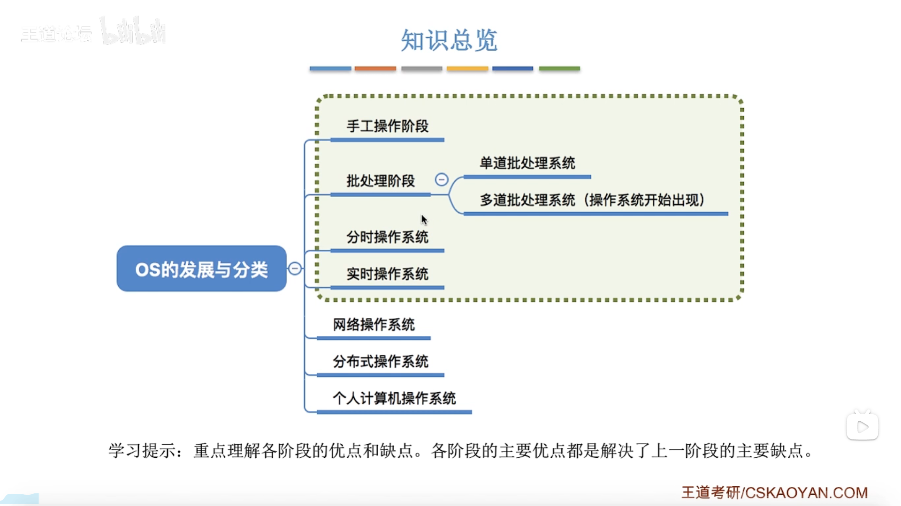
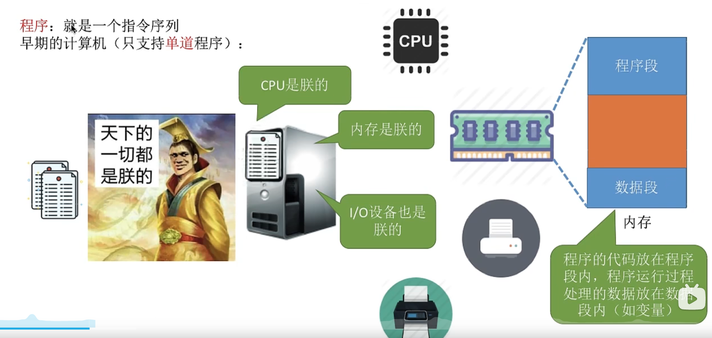
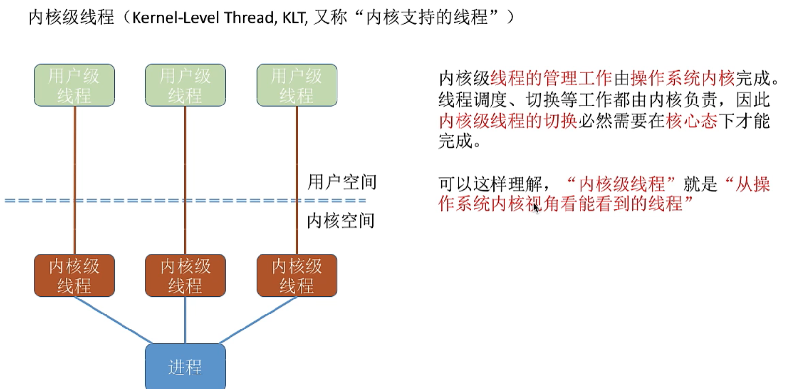
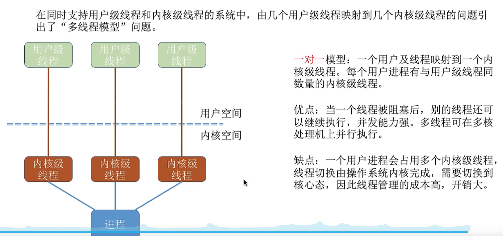
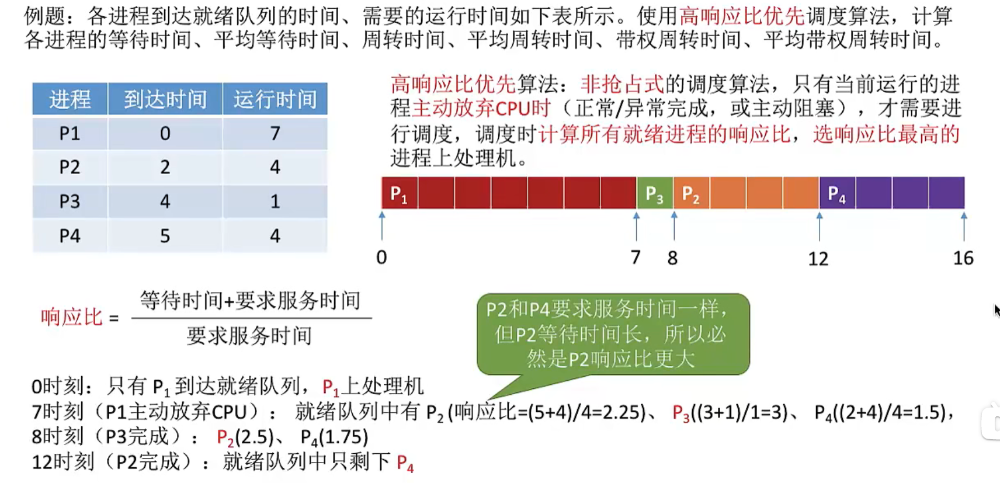
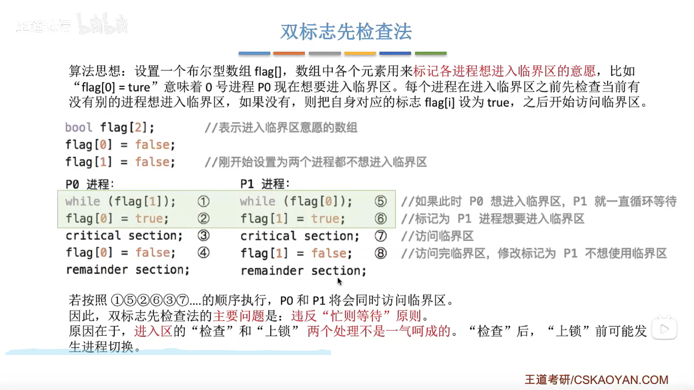
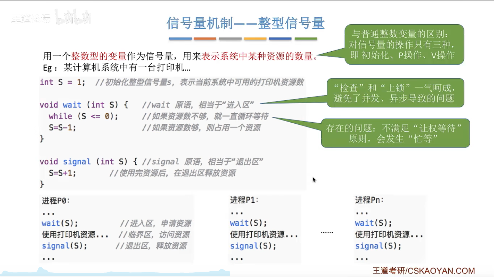
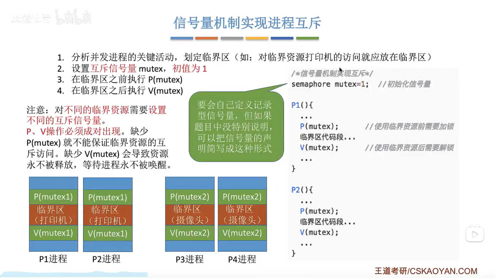
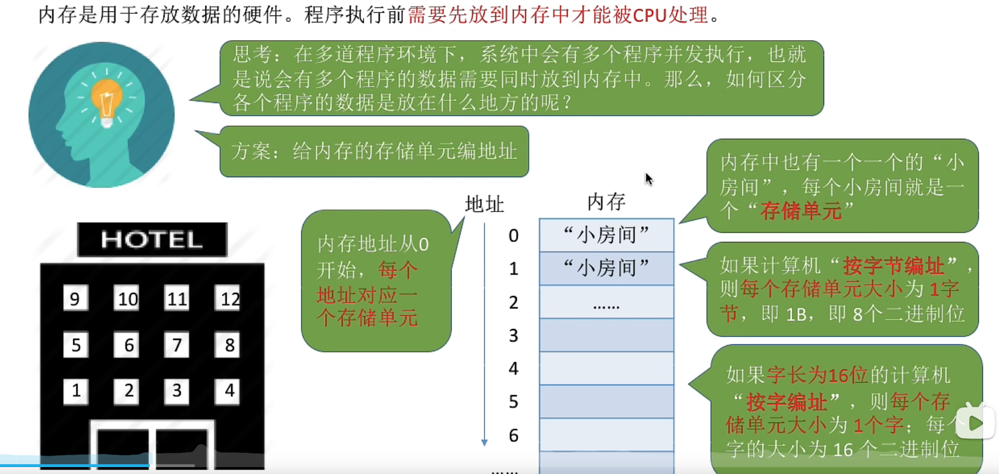
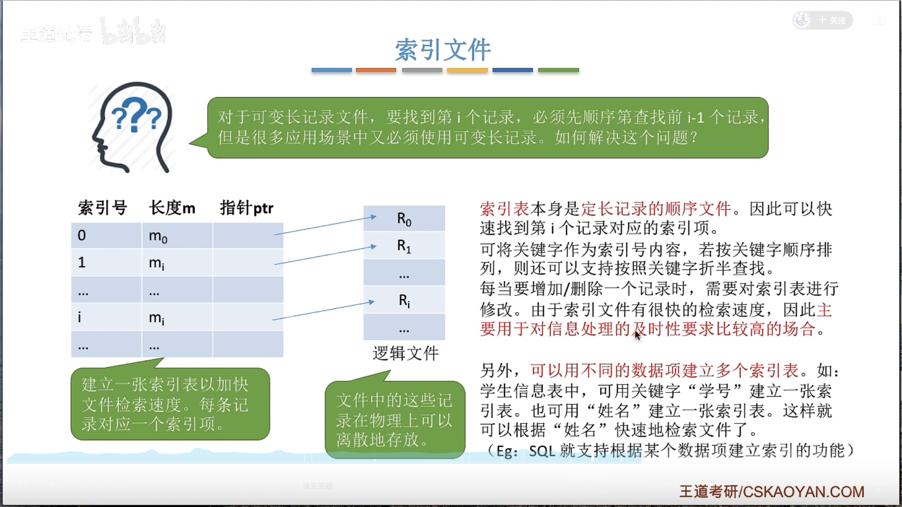

# 1.操作系统的功能和目标——作为用户和计算机硬件之间的接口

 

 

# 2.操作系统的特征

### 1.并发

 

### 2.共享

### 3.虚拟

 

 

### 4.异步

 

## 总结

 

# 3.操作系统的发展与分类

###  

### 1.手工操作阶段

 

### 2.批处理阶段—单道批处理系统

 

### 2.批处理阶段—多道批处理系统

  

### 3.分时操作系统

 

### 4.实时操作系统

 

### 5.其他几种操作系统

 

## 总结

 

# 4.操作系统的运行机制与体系结构 

### 1.什么是指令？

 

#### 两种指令

特权指令：如内存清零指令（不允许用户使用）

非特权指令：如普通的运算指令

#### 两种处理状态

用户态（目态）：此时CPU只能执行非特权指令

核心态（管态）：特权指令，非特权指令都可以执行

用程序状态字寄存器（PSW）中的某标志位来标识当前处理器处于什么状态。如0为用户态，1为核心态

#### 两种程序

内核程序：操作系统的内核程序是系统的管理者，既可以执行特权指令，也可以执行非特权指令，运行在核心态

应用程序：为了保证系统能安全运行，普通应用程序只能执行非特权指令，运行在用户态

### 2.操作系统的内核

  

 

### 3.体系结构

  

## 总结

 

# 5.中断和异常

## 1.概念和作用

 

 

## 2.中断的分类

 

 

## 3.外中断的处理过程

 

## 总结

 

# 6.系统调用

## 1.什么是系统调用

 

  

##  2.系统调用与库函数的区别

  

## 3.系统调用背后的过程

 

 

  

## 总结

 

7、进程

## 1、进程的定义

### **单道程序**

### **多道程序**

  

 

## 2、进程的组成

 

 

## 3、进程的组织

 

### 1.链接方式

 

### 2、索引方式

 

## 4.进程的特征

 

## 总结

 

## 5.进程的状态

 

 

### 1.进程状态的转换

  

### 2.进程的挂起态与七状态模型

 

### 总结

 

## 6.进程控制

### 1.什么是进程控制

  

### 2.如何实现进程控制

    

 

### 3.进程控制相关的原语

  

#### **撤销原语**

 

#### **进程的阻塞和唤醒**

 

#### 切换原语

 

### 总结

 

## 7.进程通信

### 1.共享存储

 

### 2.管道通信

 

### 3.消息传递

 

## 总结

 

# 8、线程

### 1.什么是线程

 

 

### 2.引入线程机制后，有什么变化

 

### 3.线程的属性

 

### 4.线程的实现方式

####  1.用户级线程

 

#### 2.内核级线程

 

 

### 5.多线程模型

##### 1.多对一模型

 

 

##### 2.一对一模型

 

##### 3.多对多模型

 

### 总结

 

# 9、处理机调度

### 1.调度的基本概念

  

### 2.调度的三个层次

#### 1.高级调度

 

#### 2.中级调度

 

#### 3.低级调度

 

### 3.三层调度的联系、对比

 

#### 总结

  

### 4.进程调度的时机

 

 

### 5.进程调度的方式

   

### 6.进程的切换与过程

 

#### 总结

  

### 7.调度算法的评价指标 

#### 1.CPU利用率

 

#### 2.系统吞吐量

 

#### 3.周转时间

 

 

#### 4.等待时间

 

#### 5.响应时间

 

### 总结

 

# 10、调度算法

### 1.先来先服务

  

   

### 2.短作业优先

 

#### 1.非抢占式

 

#### 2.抢占式

 

 

### 3.对FCFS和SJF两种算法的思考

 

### 4.高响应比优先

 

 

### 总结

 

### 5.时间片轮转

  

  

  

  

### 6.优先级算法

#### 1.非抢占式

 

#### 2.抢占式

 

#### 补充

 

 

### 7.各种算法的优点

 

### 8.多级反馈队列调度算法

 

  

### 总结

  

# 11.进程同步

  

 

# 12.进程互斥

 

 

##  总结

 

# 13.进程互斥的软件实现方法

## 1.单标志法

 

## 2.双标志先检查法

  

## 3.双标志后检查法

 

## 4.Peterson算法

   

## 总结

 

# 14.进程互斥的硬件实现方法 

## 1.中断屏蔽方法

 

## 2.TestAndSet指令

 

## 3.Swap指令

   

## 总结

 

# 15.信号量机制

  

## 1.信号量是什么？

 

## 2.整型信号量

 

## 3.记录型信号量

  

 

 

## 总结

 

## 4.用信号量机制实现进程互斥、同步、前驱关系 

### 1.信号量机制实现进程互斥

 

### 2.信号量机制实现进程同步

 

 

### 3.信号量机制实现前驱关系

 

### 总结

 

# 16.生产者—消费者问题

 

 

 

 

 

# 17.多生产者—多消费者问题

  

 

 

 

 

# 18.吸烟者问题

   

 

# 19.读者—写者问题

  

 

   

 

 

# 20.哲学家进餐问题

 

 

 

 

# 21.死锁

## 1.什么是死锁

## 2.死锁、饥饿、死循环的区别

 

## 3.死锁产生的必要条件

## 4.什么时候会产生死锁

 

## 5.死锁的处理策略

 

## 总结

 

## 6.死锁的处理策略——预防死锁

 

### 1.破坏互斥条件

 

### 2.破坏不剥夺条件

 

### 3.破坏请求和保持条件

​	 

### 4.破坏循环等待条件

 

### 总结

 

## 7.死锁的处理策略——避免死锁

 

### 1.什么是安全序列

 

### 2.银行家算法

 

 

 

 

 

 

## 8.死锁的处理策略——检测和解除

 

### 1.死锁的检测

 

 

 

  

 

# 22.内存

## 1.什么是内存

 

## 2.几个常用的数量单位

 

## 3.进程的运行指令——指令

 

 

## 4.从写程序到程序运行

 

## 5.装入的三种方式——绝对装入

# 虚拟内存

# 文件管理

## 1.初识文件

### 1.什么是文件

 

### 2.文件的属性

 

### 3.文件内部的数据如何组织起来？

 

 

### 4.文件之间应该怎样组织起来

 

### 5.操作系统应该向上提供哪些功能

 

 

### 6.文件管理功能

 

### 总结

 

## 2.文件的逻辑结构

 

 

### 1.有结构文件

 

### 2.顺序文件

 

 

### 3.索引文件

 

### 4.索引顺序文件

  

### 总结

 

## 3.文件目录

# I-O

## 1.I-O设备的概念和分类

  

## 

## 2.I-O控制器的功能

 

## 3.I-O控制器的组成

 

## 总结

 

## 4.I-O控制方式

 

### 1.程序直接控制方式

 

### 2.终端驱动方式

 

### 3.DMA方式

 

 	

